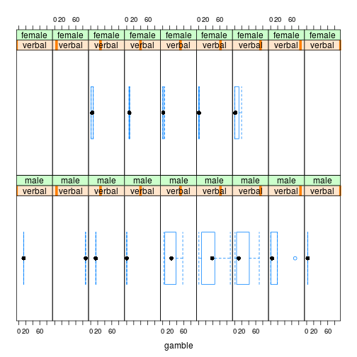
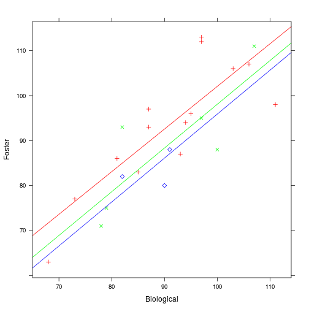
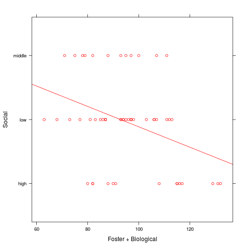
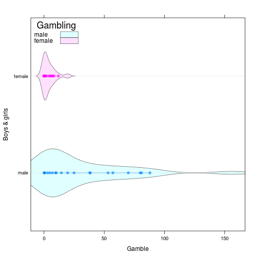

Statistical Learning, домашнее задание 2.1 (teengambling)
========================================================
Задание: Для данных teengambling (сколько денег подростки из разных социальных слоев спускают на азартные игры) провести анализ (аналогично анализу для
toothgrowth) и определить зависимость между полом, доходом, статусом, образованием и тратами на игры. Проинтерпретировать результат. Завершить анализ графиком,
который окончательно прояснит происходящее.

Hint: В исходных данных много признаков, но далеко не все они значимые.


```r
library(lattice)
library(latticeExtra)
```

```
## Loading required package: RColorBrewer
```

```r
library(MASS)
gambling <- read.table("teengambling.txt")
```


```r
gambling <- subset(gambling, gamble < 100)
gambling$sex <- factor(gambling$sex, labels = c("male","female"))
contrasts(gambling$sex) <- contr.sum
contrasts(gambling$sex)
```

```
##        [,1]
## male      1
## female   -1
```
Построим несколько графиков, чтобы понять, как ведут себя данные:

```r
bwplot(~gamble | sex, data = gambling)
```

 
- если сравнить эти два графика, то видно, что мужчины из выборки готовы потратить бОльшие суммы денег на азартные игры (средний мужчина из выборки проиграл больше, чем средняя женщина, количество потраченных денег варьируется сильнее...).


```r
bwplot(~gamble | verbal*sex, data = gambling)
```

 
- по этому графику, наверное, можно сказать, что мужчины представлены более разнообразно в смысле уровня образования в выборке. Можно заметить, что женщины в пределах одного уровня verbal почти не отличаются в количестве потраченных денег на азартные игры (либо они вообще не играют, либо ставят очень мало - наверное, предпочитают спускать деньги на что-то другое). Также видно, что больше всех тратят на казино не самые умные мужчины.  


```r
bwplot(~gamble | status, data = gambling)
```

 

- по status в том виде, в котором он представлен в данных, вообще ничего не понятно: слишком уж варьируется данная характеристика (при том, что самих наблюдений не так много).

Теперь построим линейную модель:

```r
l <- lm(gamble ~ ., data=gambling)
summary(l)
```

```
## 
## Call:
## lm(formula = gamble ~ ., data = gambling)
## 
## Residuals:
##     Min      1Q  Median      3Q     Max 
## -42.999  -8.102  -0.491   8.600  46.688 
## 
## Coefficients:
##             Estimate Std. Error t value Pr(>|t|)    
## (Intercept)  -0.5187    11.5970  -0.045   0.9645    
## sex1          8.1493     3.0667   2.657   0.0112 *  
## status        0.1739     0.2083   0.835   0.4088    
## income        4.3312     0.7636   5.672 1.26e-06 ***
## verbal       -1.8019     1.6137  -1.117   0.2707    
## ---
## Signif. codes:  0 '***' 0.001 '**' 0.01 '*' 0.05 '.' 0.1 ' ' 1
## 
## Residual standard error: 16.74 on 41 degrees of freedom
## Multiple R-squared:  0.5682,	Adjusted R-squared:  0.526 
## F-statistic: 13.49 on 4 and 41 DF,  p-value: 4.225e-07
```
Значимы пол (в основном благодаря мужчинам) и доход, самым бесполезным с точки зрения линейной модели признаком выглядит status.

Посмотрим, как изменится информационный критерий Акаике при удалении наименее значимых признаков:

```r
stepAIC(l)
```

```
## Start:  AIC=263.93
## gamble ~ sex + status + income + verbal
## 
##          Df Sum of Sq   RSS    AIC
## - status  1     195.1 11680 262.70
## - verbal  1     349.2 11834 263.31
## <none>                11485 263.93
## - sex     1    1978.1 13463 269.24
## - income  1    9012.9 20498 288.57
## 
## Step:  AIC=262.7
## gamble ~ sex + income + verbal
## 
##          Df Sum of Sq   RSS    AIC
## - verbal  1     180.9 11861 261.41
## <none>                11680 262.70
## - sex     1    3964.2 15644 274.14
## - income  1    9107.8 20788 287.22
## 
## Step:  AIC=261.41
## gamble ~ sex + income
## 
##          Df Sum of Sq   RSS    AIC
## <none>                11861 261.41
## - sex     1    3799.1 15660 272.19
## - income  1    9707.2 21568 286.92
```

```
## 
## Call:
## lm(formula = gamble ~ sex + income, data = gambling)
## 
## Coefficients:
## (Intercept)         sex1       income  
##      -4.359        9.267        4.215
```
В первую очередь на него влияет status, удаление verbal влияет, но незначительно. Поудаляем эти признаки:

```r
l <- lm(gamble ~ sex+income, data=gambling)
summary(l)
```

```
## 
## Call:
## lm(formula = gamble ~ sex + income, data = gambling)
## 
## Residuals:
##     Min      1Q  Median      3Q     Max 
## -41.063 -10.037   1.320   8.297  46.122 
## 
## Coefficients:
##             Estimate Std. Error t value Pr(>|t|)    
## (Intercept)  -4.3593     4.0339  -1.081 0.285869    
## sex1          9.2670     2.4971   3.711 0.000588 ***
## income        4.2155     0.7106   5.932 4.59e-07 ***
## ---
## Signif. codes:  0 '***' 0.001 '**' 0.01 '*' 0.05 '.' 0.1 ' ' 1
## 
## Residual standard error: 16.61 on 43 degrees of freedom
## Multiple R-squared:  0.554,	Adjusted R-squared:  0.5333 
## F-statistic: 26.71 on 2 and 43 DF,  p-value: 2.883e-08
```

Сравним с моделью, в которой учитывается взаимное влияние признаков:

```r
l.cross <- lm(gamble ~ sex*income, data=gambling)
summary(l.cross)
```

```
## 
## Call:
## lm(formula = gamble ~ sex * income, data = gambling)
## 
## Residuals:
##     Min      1Q  Median      3Q     Max 
## -47.085  -4.549  -1.892   6.604  46.458 
## 
## Coefficients:
##             Estimate Std. Error t value Pr(>|t|)    
## (Intercept)   1.2553     3.9767   0.316 0.753824    
## sex1         -1.8847     3.9767  -0.474 0.638006    
## income        2.7732     0.7658   3.621 0.000783 ***
## sex1:income   2.5983     0.7658   3.393 0.001519 ** 
## ---
## Signif. codes:  0 '***' 0.001 '**' 0.01 '*' 0.05 '.' 0.1 ' ' 1
## 
## Residual standard error: 14.89 on 42 degrees of freedom
## Multiple R-squared:   0.65,	Adjusted R-squared:  0.625 
## F-statistic:    26 on 3 and 42 DF,  p-value: 1.146e-09
```

```r
stepAIC(l.cross)
```

```
## Start:  AIC=252.27
## gamble ~ sex * income
## 
##              Df Sum of Sq     RSS    AIC
## <none>                     9309.6 252.27
## - sex:income  1    2551.5 11861.1 261.41
```

```
## 
## Call:
## lm(formula = gamble ~ sex * income, data = gambling)
## 
## Coefficients:
## (Intercept)         sex1       income  sex1:income  
##       1.255       -1.885        2.773        2.598
```

```r
anova(l, l.cross)
```

```
## Analysis of Variance Table
## 
## Model 1: gamble ~ sex + income
## Model 2: gamble ~ sex * income
##   Res.Df     RSS Df Sum of Sq      F   Pr(>F)   
## 1     43 11861.1                                
## 2     42  9309.6  1    2551.5 11.511 0.001519 **
## ---
## Signif. codes:  0 '***' 0.001 '**' 0.01 '*' 0.05 '.' 0.1 ' ' 1
```
Видим, что более значимой будет являться модель, в которой учитывается взаимное влияние пола и дохода.

**Красивый график**:

```r
gambling.agg <- aggregate(subset(gambling, select = gamble), list(sex = gambling$sex, income = gambling$income), mean)
dp <- dotplot(factor(sex) ~ gamble, groups = sex, data = gambling.agg, auto.key = list(title = "Delivery", corner = c(0, 1)), type = "b", xlab = "mean(gambling length)", ylab = "Vitamin C dose", par.settings = simpleTheme(pch = 19))

vp <- bwplot(factor(sex) ~ gamble, groups = sex, data = gambling, panel = function(...) {
  panel.superpose(..., col = trellis.par.get("superpose.polygon")$col,
  panel.groups = panel.violin)
  }, auto.key = list(title = "Gambling",
  corner = c(0, 1), points = FALSE,
  lines = FALSE, rectangles = TRUE),
  xlab = "Gamble", ylab = "Boys & girls",
  par.settings = simpleTheme(alpha = 0.6,
  pch = 19)
)
vp + dp
```

 

Видно, что в представленном наборе данных мальчики имеют склонность к азартным игры больше, чем девочки.


*Рассмотрим только женщин*:

```r
gambling.female <- subset(gambling, sex == "female", select = -sex)
l.female <- lm(gamble ~ ., data=gambling.female)
summary(l.female)
```

```
## 
## Call:
## lm(formula = gamble ~ ., data = gambling.female)
## 
## Residuals:
##     Min      1Q  Median      3Q     Max 
## -8.6972 -2.0567 -0.5836  2.6533 11.2536 
## 
## Coefficients:
##             Estimate Std. Error t value Pr(>|t|)  
## (Intercept)  -5.3778     7.1848  -0.749   0.4657  
## status        0.2073     0.1038   1.997   0.0643 .
## income        0.6813     0.5177   1.316   0.2079  
## verbal       -0.1392     0.9259  -0.150   0.8825  
## ---
## Signif. codes:  0 '***' 0.001 '**' 0.01 '*' 0.05 '.' 0.1 ' ' 1
## 
## Residual standard error: 4.974 on 15 degrees of freedom
## Multiple R-squared:  0.2228,	Adjusted R-squared:  0.06738 
## F-statistic: 1.433 on 3 and 15 DF,  p-value: 0.2723
```

```r
stepAIC(l.female)
```

```
## Start:  AIC=64.47
## gamble ~ status + income + verbal
## 
##          Df Sum of Sq    RSS    AIC
## - verbal  1     0.560 371.70 62.499
## <none>                371.14 64.470
## - income  1    42.854 413.99 64.547
## - status  1    98.666 469.80 66.950
## 
## Step:  AIC=62.5
## gamble ~ status + income
## 
##          Df Sum of Sq    RSS    AIC
## <none>                371.70 62.499
## - income  1    43.643 415.34 62.608
## - status  1   102.127 473.82 65.111
```

```
## 
## Call:
## lm(formula = gamble ~ status + income, data = gambling.female)
## 
## Coefficients:
## (Intercept)       status       income  
##     -6.1437       0.2031       0.6862
```

```r
l.female <- update(l.female, . ~ .-verbal)
summary(l.female)
```

```
## 
## Call:
## lm(formula = gamble ~ status + income, data = gambling.female)
## 
## Residuals:
##     Min      1Q  Median      3Q     Max 
## -8.5269 -2.0648 -0.4493  2.7694 11.1694 
## 
## Coefficients:
##             Estimate Std. Error t value Pr(>|t|)  
## (Intercept) -6.14371    4.91115  -1.251   0.2289  
## status       0.20311    0.09687   2.097   0.0523 .
## income       0.68619    0.50064   1.371   0.1894  
## ---
## Signif. codes:  0 '***' 0.001 '**' 0.01 '*' 0.05 '.' 0.1 ' ' 1
## 
## Residual standard error: 4.82 on 16 degrees of freedom
## Multiple R-squared:  0.2216,	Adjusted R-squared:  0.1244 
## F-statistic: 2.278 on 2 and 16 DF,  p-value: 0.1347
```
Получили, что уровень образования на склонность к азартным играм не влияет. Влияют status и уровень дохода. Мы знаем, что это связанные величины, поэтому

```r
l.female <- lm(gamble ~ income*status, data=gambling.female)
summary(l.female)
```

```
## 
## Call:
## lm(formula = gamble ~ income * status, data = gambling.female)
## 
## Residuals:
##    Min     1Q Median     3Q    Max 
## -7.184 -2.890 -0.046  2.444  8.727 
## 
## Coefficients:
##                Estimate Std. Error t value Pr(>|t|)  
## (Intercept)   -12.10985    6.73755  -1.797   0.0924 .
## income          2.47256    1.49258   1.657   0.1184  
## status          0.41386    0.19154   2.161   0.0473 *
## income:status  -0.06818    0.05379  -1.267   0.2243  
## ---
## Signif. codes:  0 '***' 0.001 '**' 0.01 '*' 0.05 '.' 0.1 ' ' 1
## 
## Residual standard error: 4.731 on 15 degrees of freedom
## Multiple R-squared:  0.2969,	Adjusted R-squared:  0.1563 
## F-statistic: 2.112 on 3 and 15 DF,  p-value: 0.1416
```


*Рассмотрим только мужчин*:

```r
gambling.male <- subset(gambling, sex == "male", select = -sex)
l.male <- lm(gamble ~ ., data=gambling.male)
summary(l.male)
```

```
## 
## Call:
## lm(formula = gamble ~ ., data = gambling.male)
## 
## Residuals:
##     Min      1Q  Median      3Q     Max 
## -48.332 -10.306  -2.114  10.809  48.131 
## 
## Coefficients:
##             Estimate Std. Error t value Pr(>|t|)    
## (Intercept)  10.6630    16.5377   0.645    0.525    
## status        0.0403     0.3063   0.132    0.896    
## income        5.2910     0.9780   5.410  1.7e-05 ***
## verbal       -1.8827     2.2351  -0.842    0.408    
## ---
## Signif. codes:  0 '***' 0.001 '**' 0.01 '*' 0.05 '.' 0.1 ' ' 1
## 
## Residual standard error: 19.22 on 23 degrees of freedom
## Multiple R-squared:  0.5971,	Adjusted R-squared:  0.5446 
## F-statistic: 11.36 on 3 and 23 DF,  p-value: 9.023e-05
```
Видим явную зависимость ставок от уровня дохода (которую мы наблюдали и в основной выборке).
