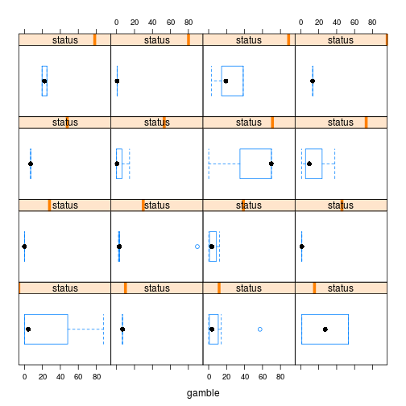
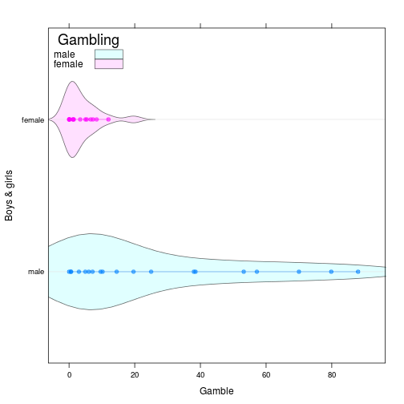

Statistical Learning, домашнее задание 2.1 (teengambling)
========================================================
Задание: Для данных teengambling (сколько денег подростки из разных социальных слоев спускают на азартные игры) провести анализ (аналогично анализу для
toothgrowth) и определить зависимость между полом, доходом, статусом, образованием и тратами на игры. Проинтерпретировать результат. Завершить анализ графиком,
который окончательно прояснит происходящее.

Hint: В исходных данных много признаков, но далеко не все они значимые.


```r
library(lattice)
library(latticeExtra)
```

```
## Loading required package: RColorBrewer
```

```r
library(MASS)
gambling <- read.table("teengambling.txt")
```


```r
gambling$sex <- factor(gambling$sex, labels = c("male","female"))
contrasts(gambling$sex) <- contr.sum
contrasts(gambling$sex)
```

```
##        [,1]
## male      1
## female   -1
```
Построим несколько графиков, чтобы понять, как ведут себя данные:

```r
bwplot(~gamble | sex, data = gambling)
```

 
- здесь видно явную зависимость количества денег, потраченных на азартные игры, от пола игрока (а также, что мужчины из выборки ставят бОльшие суммы).


```r
bwplot(~gamble | verbal*sex, data = gambling)
```

 
- по этому графику, наверное, можно сказать, что мужчины представлены более разнообразно в смысле уровня образования в выборке. Можно заметить, что женщины в пределах одного уровня verbal почти не отличаются в количестве потраченных денег на азартные игры (либо они вообще не играют, либо ставят очень мало - наверное, предпочитают спускать деньги на что-то другое). Также видно, что больше всех тратят на казино не самые умные мужчины.  


```r
bwplot(~gamble | status, data = gambling)
```

 

- по status в том виде, в котором он представлен в данных, вообще ничего не понятно: слишком уж варьируется данная характеристика (при том, что самих наблюдений не так много).

Теперь построим линейную модель:

```r
l <- lm(gamble ~ ., data=gambling)
summary(l)
```

```
## 
## Call:
## lm(formula = gamble ~ ., data = gambling)
## 
## Residuals:
##     Min      1Q  Median      3Q     Max 
## -51.082 -11.320  -1.451   9.452  94.252 
## 
## Coefficients:
##             Estimate Std. Error t value Pr(>|t|)    
## (Intercept) 11.49649   15.48722   0.742   0.4620    
## sex1        11.05917    4.10556   2.694   0.0101 *  
## status       0.05223    0.28111   0.186   0.8535    
## income       4.96198    1.02539   4.839 1.79e-05 ***
## verbal      -2.95949    2.17215  -1.362   0.1803    
## ---
## Signif. codes:  0 '***' 0.001 '**' 0.01 '*' 0.05 '.' 0.1 ' ' 1
## 
## Residual standard error: 22.69 on 42 degrees of freedom
## Multiple R-squared:  0.5267,	Adjusted R-squared:  0.4816 
## F-statistic: 11.69 on 4 and 42 DF,  p-value: 1.815e-06
```
Значимы пол (в основном благодаря мужчинам) и доход, самым бесполезным с точки зрения линейной модели признаком выглядит status.

Посмотрим, как изменится информационный критерий Акаике при удалении наименее значимых признаков:

```r
stepAIC(l)
```

```
## Start:  AIC=298.18
## gamble ~ sex + status + income + verbal
## 
##          Df Sum of Sq   RSS    AIC
## - status  1      17.8 21642 296.21
## <none>                21624 298.18
## - verbal  1     955.7 22580 298.21
## - sex     1    3735.8 25360 303.67
## - income  1   12056.2 33680 317.00
## 
## Step:  AIC=296.21
## gamble ~ sex + income + verbal
## 
##          Df Sum of Sq   RSS    AIC
## <none>                21642 296.21
## - verbal  1    1139.8 22781 296.63
## - sex     1    5787.9 27429 305.35
## - income  1   13236.1 34878 316.64
```

```
## 
## Call:
## lm(formula = gamble ~ sex + income + verbal, data = gambling)
## 
## Coefficients:
## (Intercept)         sex1       income       verbal  
##      12.659       11.480        4.898       -2.747
```
В первую очередь на него влияет status, удаление verbal влияет, но незначительно. Поудаляем эти признаки:

```r
l <- lm(gamble ~ sex+income, data=gambling)
summary(l)
```

```
## 
## Call:
## lm(formula = gamble ~ sex + income, data = gambling)
## 
## Residuals:
##     Min      1Q  Median      3Q     Max 
## -49.757 -11.649   0.844   8.659 100.243 
## 
## Coefficients:
##             Estimate Std. Error t value Pr(>|t|)    
## (Intercept)   -6.776      5.501  -1.232  0.22459    
## sex1          10.817      3.404   3.177  0.00272 ** 
## income         5.172      0.951   5.438 2.24e-06 ***
## ---
## Signif. codes:  0 '***' 0.001 '**' 0.01 '*' 0.05 '.' 0.1 ' ' 1
## 
## Residual standard error: 22.75 on 44 degrees of freedom
## Multiple R-squared:  0.5014,	Adjusted R-squared:  0.4787 
## F-statistic: 22.12 on 2 and 44 DF,  p-value: 2.243e-07
```

Сравним с моделью, в которой учитывается взаимное влияние признаков:

```r
l.cross <- lm(gamble ~ sex*income, data=gambling)
summary(l.cross)
```

```
## 
## Call:
## lm(formula = gamble ~ sex * income, data = gambling)
## 
## Residuals:
##     Min      1Q  Median      3Q     Max 
## -56.522  -4.860  -1.790   6.273  93.478 
## 
## Coefficients:
##             Estimate Std. Error t value Pr(>|t|)   
## (Intercept)   0.2402     5.6001   0.043  0.96599   
## sex1         -2.8998     5.6001  -0.518  0.60724   
## income        3.3465     1.0723   3.121  0.00322 **
## sex1:income   3.1716     1.0723   2.958  0.00502 **
## ---
## Signif. codes:  0 '***' 0.001 '**' 0.01 '*' 0.05 '.' 0.1 ' ' 1
## 
## Residual standard error: 20.98 on 43 degrees of freedom
## Multiple R-squared:  0.5857,	Adjusted R-squared:  0.5568 
## F-statistic: 20.26 on 3 and 43 DF,  p-value: 2.451e-08
```

```r
stepAIC(l.cross)
```

```
## Start:  AIC=289.92
## gamble ~ sex * income
## 
##              Df Sum of Sq   RSS    AIC
## <none>                    18930 289.92
## - sex:income  1    3851.4 22781 296.63
```

```
## 
## Call:
## lm(formula = gamble ~ sex * income, data = gambling)
## 
## Coefficients:
## (Intercept)         sex1       income  sex1:income  
##      0.2402      -2.8998       3.3465       3.1716
```

```r
anova(l, l.cross)
```

```
## Analysis of Variance Table
## 
## Model 1: gamble ~ sex + income
## Model 2: gamble ~ sex * income
##   Res.Df   RSS Df Sum of Sq      F   Pr(>F)   
## 1     44 22781                                
## 2     43 18930  1    3851.4 8.7486 0.005018 **
## ---
## Signif. codes:  0 '***' 0.001 '**' 0.01 '*' 0.05 '.' 0.1 ' ' 1
```
Видим, что более значимой будет являться модель, в которой учитывается взаимное влияние пола и дохода.


```r
gambling.agg <- aggregate(subset(gambling, select = gamble), list(sex = gambling$sex, income = gambling$income), mean)
dp <- dotplot(factor(sex) ~ gamble, groups = sex, data = gambling.agg, auto.key = list(title = "Delivery", corner = c(0, 1)), type = "b", xlab = "mean(gambling length)", ylab = "Vitamin C dose", par.settings = simpleTheme(pch = 19))

vp <- bwplot(factor(sex) ~ gamble, groups = sex, data = gambling, panel = function(...) {
  panel.superpose(..., col = trellis.par.get("superpose.polygon")$col,
  panel.groups = panel.violin)
  }, auto.key = list(title = "Gambling",
  corner = c(0, 1), points = FALSE,
  lines = FALSE, rectangles = TRUE),
  xlab = "Gamble", ylab = "Boys & girls",
  par.settings = simpleTheme(alpha = 0.6,
  pch = 19)
)
vp + dp
```

 

Видно, что в представленном наборе данных мальчики имеют склонность к азартным игры больше, чем девочки.


*Рассмотрим только женщин*:

```r
gambling.female <- subset(gambling, sex == "female", select = -sex)
l.female <- lm(gamble ~ ., data=gambling.female)
summary(l.female)
```

```
## 
## Call:
## lm(formula = gamble ~ ., data = gambling.female)
## 
## Residuals:
##     Min      1Q  Median      3Q     Max 
## -8.6972 -2.0567 -0.5836  2.6533 11.2536 
## 
## Coefficients:
##             Estimate Std. Error t value Pr(>|t|)  
## (Intercept)  -5.3778     7.1848  -0.749   0.4657  
## status        0.2073     0.1038   1.997   0.0643 .
## income        0.6813     0.5177   1.316   0.2079  
## verbal       -0.1392     0.9259  -0.150   0.8825  
## ---
## Signif. codes:  0 '***' 0.001 '**' 0.01 '*' 0.05 '.' 0.1 ' ' 1
## 
## Residual standard error: 4.974 on 15 degrees of freedom
## Multiple R-squared:  0.2228,	Adjusted R-squared:  0.06738 
## F-statistic: 1.433 on 3 and 15 DF,  p-value: 0.2723
```

```r
stepAIC(l.female)
```

```
## Start:  AIC=64.47
## gamble ~ status + income + verbal
## 
##          Df Sum of Sq    RSS    AIC
## - verbal  1     0.560 371.70 62.499
## <none>                371.14 64.470
## - income  1    42.854 413.99 64.547
## - status  1    98.666 469.80 66.950
## 
## Step:  AIC=62.5
## gamble ~ status + income
## 
##          Df Sum of Sq    RSS    AIC
## <none>                371.70 62.499
## - income  1    43.643 415.34 62.608
## - status  1   102.127 473.82 65.111
```

```
## 
## Call:
## lm(formula = gamble ~ status + income, data = gambling.female)
## 
## Coefficients:
## (Intercept)       status       income  
##     -6.1437       0.2031       0.6862
```

```r
l.female <- update(l.female, . ~ .-verbal)
summary(l.female)
```

```
## 
## Call:
## lm(formula = gamble ~ status + income, data = gambling.female)
## 
## Residuals:
##     Min      1Q  Median      3Q     Max 
## -8.5269 -2.0648 -0.4493  2.7694 11.1694 
## 
## Coefficients:
##             Estimate Std. Error t value Pr(>|t|)  
## (Intercept) -6.14371    4.91115  -1.251   0.2289  
## status       0.20311    0.09687   2.097   0.0523 .
## income       0.68619    0.50064   1.371   0.1894  
## ---
## Signif. codes:  0 '***' 0.001 '**' 0.01 '*' 0.05 '.' 0.1 ' ' 1
## 
## Residual standard error: 4.82 on 16 degrees of freedom
## Multiple R-squared:  0.2216,	Adjusted R-squared:  0.1244 
## F-statistic: 2.278 on 2 and 16 DF,  p-value: 0.1347
```
Получили, что уровень образования на склонность к азартным играм не влияет. Влияют status и уровень дохода. Мы знаем, что это связанные величины, поэтому

```r
l.female <- lm(gamble ~ income*status, data=gambling.female)
summary(l.female)
```

```
## 
## Call:
## lm(formula = gamble ~ income * status, data = gambling.female)
## 
## Residuals:
##    Min     1Q Median     3Q    Max 
## -7.184 -2.890 -0.046  2.444  8.727 
## 
## Coefficients:
##                Estimate Std. Error t value Pr(>|t|)  
## (Intercept)   -12.10985    6.73755  -1.797   0.0924 .
## income          2.47256    1.49258   1.657   0.1184  
## status          0.41386    0.19154   2.161   0.0473 *
## income:status  -0.06818    0.05379  -1.267   0.2243  
## ---
## Signif. codes:  0 '***' 0.001 '**' 0.01 '*' 0.05 '.' 0.1 ' ' 1
## 
## Residual standard error: 4.731 on 15 degrees of freedom
## Multiple R-squared:  0.2969,	Adjusted R-squared:  0.1563 
## F-statistic: 2.112 on 3 and 15 DF,  p-value: 0.1416
```


*Рассмотрим только мужчин*:

```r
gambling.male <- subset(gambling, sex == "male", select = -sex)
l.male <- lm(gamble ~ ., data=gambling.male)
summary(l.male)
```

```
## 
## Call:
## lm(formula = gamble ~ ., data = gambling.male)
## 
## Residuals:
##     Min      1Q  Median      3Q     Max 
## -56.654 -12.104  -2.061   7.729  83.903 
## 
## Coefficients:
##             Estimate Std. Error t value Pr(>|t|)    
## (Intercept)  27.6354    22.2192   1.244 0.225600    
## status       -0.1456     0.4181  -0.348 0.730748    
## income        6.0291     1.3288   4.537 0.000135 ***
## verbal       -2.9748     3.0596  -0.972 0.340617    
## ---
## Signif. codes:  0 '***' 0.001 '**' 0.01 '*' 0.05 '.' 0.1 ' ' 1
## 
## Residual standard error: 26.45 on 24 degrees of freedom
## Multiple R-squared:  0.5536,	Adjusted R-squared:  0.4977 
## F-statistic: 9.919 on 3 and 24 DF,  p-value: 0.0001936
```
Видим явную зависимость ставок от уровня дохода (которую мы наблюдали и в основной выборке).
