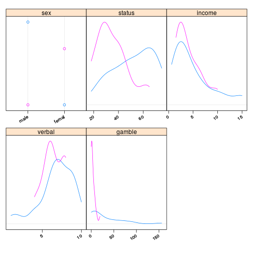

Statistical Learning, домашнее задание 2.1 (teengambling) - дополнение
======================================================================
Задание: Для данных teengambling (сколько денег подростки из разных социальных слоев спускают на азартные игры) провести анализ (аналогично анализу для
toothgrowth) и определить зависимость между полом, доходом, статусом, образованием и тратами на игры. Проинтерпретировать результат. Завершить анализ графиком,
который окончательно прояснит происходящее.

Hint: В исходных данных много признаков, но далеко не все они значимые.


```r
library(lattice)
library(latticeExtra)
```

```
## Loading required package: RColorBrewer
```

```r
library(MASS)
gambling <- read.table("teengambling.txt")
gambling$sex <- factor(gambling$sex, labels = c("male","female"))
contrasts(gambling$sex) <- contr.sum
contrasts(gambling$sex)
```

```
##        [,1]
## male      1
## female   -1
```
Построим несколько графиков, чтобы понять, как ведут себя данные:

```r
bwplot(~gamble | sex, data = gambling)
```

 

На графике с мужчинами выделяется один, который находится далеко за пределами усов барплота и готов поставить слишком много (150). Наверное, он gambling-addicted и может существенно влиять на картину. Уберем его.


```r
gambling <- subset(gambling, gamble < 100)
```

Теперь построим линейную модель, как мы это делали раньше:

```r
l <- lm(gamble ~ ., data=gambling)
summary(l)
```

```
## 
## Call:
## lm(formula = gamble ~ ., data = gambling)
## 
## Residuals:
##     Min      1Q  Median      3Q     Max 
## -42.999  -8.102  -0.491   8.600  46.688 
## 
## Coefficients:
##             Estimate Std. Error t value Pr(>|t|)    
## (Intercept)  -0.5187    11.5970  -0.045   0.9645    
## sex1          8.1493     3.0667   2.657   0.0112 *  
## status        0.1739     0.2083   0.835   0.4088    
## income        4.3312     0.7636   5.672 1.26e-06 ***
## verbal       -1.8019     1.6137  -1.117   0.2707    
## ---
## Signif. codes:  0 '***' 0.001 '**' 0.01 '*' 0.05 '.' 0.1 ' ' 1
## 
## Residual standard error: 16.74 on 41 degrees of freedom
## Multiple R-squared:  0.5682,	Adjusted R-squared:  0.526 
## F-statistic: 13.49 on 4 and 41 DF,  p-value: 4.225e-07
```
Значимы пол (в основном благодаря мужчинам) и доход. verbal стал влиять меньше.

Дальше то же самое, только на откорректированном наборе данных. Посмотрим, как изменится информационный критерий Акаике при удалении наименее значимых признаков:

```r
stepAIC(l)
```

```
## Start:  AIC=263.93
## gamble ~ sex + status + income + verbal
## 
##          Df Sum of Sq   RSS    AIC
## - status  1     195.1 11680 262.70
## - verbal  1     349.2 11834 263.31
## <none>                11485 263.93
## - sex     1    1978.1 13463 269.24
## - income  1    9012.9 20498 288.57
## 
## Step:  AIC=262.7
## gamble ~ sex + income + verbal
## 
##          Df Sum of Sq   RSS    AIC
## - verbal  1     180.9 11861 261.41
## <none>                11680 262.70
## - sex     1    3964.2 15644 274.14
## - income  1    9107.8 20788 287.22
## 
## Step:  AIC=261.41
## gamble ~ sex + income
## 
##          Df Sum of Sq   RSS    AIC
## <none>                11861 261.41
## - sex     1    3799.1 15660 272.19
## - income  1    9707.2 21568 286.92
```

```
## 
## Call:
## lm(formula = gamble ~ sex + income, data = gambling)
## 
## Coefficients:
## (Intercept)         sex1       income  
##      -4.359        9.267        4.215
```
Видим, что удаление verbal теперь тоже существенно улучшило линейную модель.

```r
l <- lm(gamble ~ sex+income, data=gambling)
summary(l)
```

```
## 
## Call:
## lm(formula = gamble ~ sex + income, data = gambling)
## 
## Residuals:
##     Min      1Q  Median      3Q     Max 
## -41.063 -10.037   1.320   8.297  46.122 
## 
## Coefficients:
##             Estimate Std. Error t value Pr(>|t|)    
## (Intercept)  -4.3593     4.0339  -1.081 0.285869    
## sex1          9.2670     2.4971   3.711 0.000588 ***
## income        4.2155     0.7106   5.932 4.59e-07 ***
## ---
## Signif. codes:  0 '***' 0.001 '**' 0.01 '*' 0.05 '.' 0.1 ' ' 1
## 
## Residual standard error: 16.61 on 43 degrees of freedom
## Multiple R-squared:  0.554,	Adjusted R-squared:  0.5333 
## F-statistic: 26.71 on 2 and 43 DF,  p-value: 2.883e-08
```

Сравним с моделью, в которой учитывается взаимное влияние признаков:

```r
l.cross <- lm(gamble ~ sex*income, data=gambling)
summary(l.cross)
```

```
## 
## Call:
## lm(formula = gamble ~ sex * income, data = gambling)
## 
## Residuals:
##     Min      1Q  Median      3Q     Max 
## -47.085  -4.549  -1.892   6.604  46.458 
## 
## Coefficients:
##             Estimate Std. Error t value Pr(>|t|)    
## (Intercept)   1.2553     3.9767   0.316 0.753824    
## sex1         -1.8847     3.9767  -0.474 0.638006    
## income        2.7732     0.7658   3.621 0.000783 ***
## sex1:income   2.5983     0.7658   3.393 0.001519 ** 
## ---
## Signif. codes:  0 '***' 0.001 '**' 0.01 '*' 0.05 '.' 0.1 ' ' 1
## 
## Residual standard error: 14.89 on 42 degrees of freedom
## Multiple R-squared:   0.65,	Adjusted R-squared:  0.625 
## F-statistic:    26 on 3 and 42 DF,  p-value: 1.146e-09
```

```r
stepAIC(l.cross)
```

```
## Start:  AIC=252.27
## gamble ~ sex * income
## 
##              Df Sum of Sq     RSS    AIC
## <none>                     9309.6 252.27
## - sex:income  1    2551.5 11861.1 261.41
```

```
## 
## Call:
## lm(formula = gamble ~ sex * income, data = gambling)
## 
## Coefficients:
## (Intercept)         sex1       income  sex1:income  
##       1.255       -1.885        2.773        2.598
```

```r
anova(l, l.cross)
```

```
## Analysis of Variance Table
## 
## Model 1: gamble ~ sex + income
## Model 2: gamble ~ sex * income
##   Res.Df     RSS Df Sum of Sq      F   Pr(>F)   
## 1     43 11861.1                                
## 2     42  9309.6  1    2551.5 11.511 0.001519 **
## ---
## Signif. codes:  0 '***' 0.001 '**' 0.01 '*' 0.05 '.' 0.1 ' ' 1
```
Видим, что более значимой будет являться модель, в которой учитывается взаимное влияние пола и дохода.

**Красивый график**:

```r
gambling.agg <- aggregate(subset(gambling, select = gamble), list(sex = gambling$sex, income = gambling$income), mean)
dp <- dotplot(factor(sex) ~ gamble, groups = sex, data = gambling.agg, auto.key = list(title = "Delivery", corner = c(0, 1)), type = "b", xlab = "mean(gambling length)", ylab = "Vitamin C dose", par.settings = simpleTheme(pch = 19))

vp <- bwplot(factor(sex) ~ gamble, groups = sex, data = gambling, panel = function(...) {
  panel.superpose(..., col = trellis.par.get("superpose.polygon")$col,
  panel.groups = panel.violin)
  }, auto.key = list(title = "Gambling",
  corner = c(0, 1), points = FALSE,
  lines = FALSE, rectangles = TRUE),
  xlab = "Gamble", ylab = "Boys & girls",
  par.settings = simpleTheme(alpha = 0.6,
  pch = 19)
)
vp + dp
```

 

