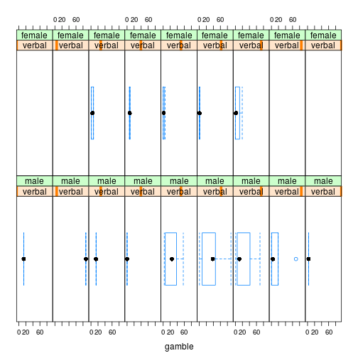

Statistical Learning, домашнее задание 2.2 (twins)
========================================================
Задание 2.2. Данные twins взяты из статьи Cyril Burt, 1966: “The genetic determination
of differences in intelligence: A study of monozygotic twins reared apart”. Данные содержат
сведения об IQ разлученных однояйцевых (идентичных) близнецов, один из которых
выращен биологическими, а другой приемными родителями. Также известен социальный класс биологических родителей. Нужно построить зависимость интеллекта приемного ребенка от интеллекта его близнеца и социального класса его биологических родителей и проинтерпретировать результат.


```r
library(lattice)
library(latticeExtra)
```

```
## Loading required package: RColorBrewer
```

```r
library(MASS)
panel <- function(...) {
  panel.xyplot(...)
  panel.lmline(...)
}
twins <- read.table("twins.txt")
```

Попробуем изобразить зависимость Foster от Biological, выделив цветом точки, соответствующие разным значениям Social.

```r
col <- c("red", "green", "blue")
socialLvls <- factor(twins$Social)
xyplot(Foster ~ Biological, data=twins, panel = panel, col=c(col[factor(socialLvls)],"black"))
```

 
Выглядит уже как-то странно. Построим линейные модели для подмножеств с разным значением Social.

```r
twins.low <- subset(twins, Social == "low")
twins.low.lm <- lm(Foster~Biological, data=twins.low)
twins.middle <- subset(twins, Social == "middle")
twins.middle.lm <- lm(Foster~Biological, data=twins.middle)
twins.high <- subset(twins, Social == "high")
twins.high.lm <- lm(Foster~Biological, data=twins.high)

print(twins.low.lm) 
```

```
## 
## Call:
## lm(formula = Foster ~ Biological, data = twins.low)
## 
## Coefficients:
## (Intercept)   Biological  
##      7.2046       0.9484
```

```r
print(twins.middle.lm)
```

```
## 
## Call:
## lm(formula = Foster ~ Biological, data = twins.middle)
## 
## Coefficients:
## (Intercept)   Biological  
##      0.8160       0.9726
```

```r
print(twins.high.lm)
```

```
## 
## Call:
## lm(formula = Foster ~ Biological, data = twins.high)
## 
## Coefficients:
## (Intercept)   Biological  
##     -1.8720       0.9776
```

```r
xyplot(Foster ~ Biological, data=twins.low, panel = panel, pch=3,col="red") + xyplot(Foster ~ Biological, data=twins.middle, panel = panel, pch=4, col="green") + xyplot(Foster ~ Biological, data=twins.high, panel = panel, pch=5, col="blue")
```

 

Кажется странным, что линейные модели, построенные по подмножествам, составленным по каждому из классов Social в выборке, отличаются только сдвигом, угол наклона прямой во всех трех случаях почти идентичен (примерно 0.9726, отличаются сотой долей). При небольшом наборе данных такая картина выглядит невероятной.
