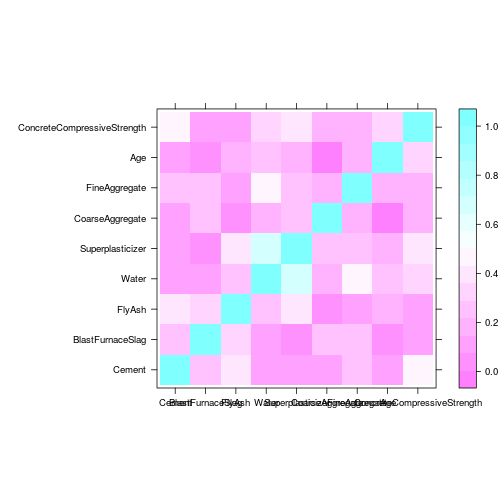

Title
========================================================
Задание 1.1. Рассмотрим данные concrete. Описание и сами данные в архиве, кратко суть. Данные по прочности разных сортов бетона в зависимости от пропорций компонент и времени залития. Надо построить регрессию на прочность.

Предлагается использовать линейную регрессию и понять, что и как влияет на качество бетона. Обратите внимание, что параметры между собой зависимы, поэтому коэффициенты следует интерепретировать аккуратнее. Рекомендую построить одномерные графики зависимостей прочности от всего остального и попробовать определить характер. Возможно, что зависимость будет немонотонная, тогда стоит ввести
дополнительный фактор “больше ли значение предиктора некоторого порога”. Некоторые предикторы могут оказаться не совсем непрерывными, возможно, что их стоит рассмотреть как факторы.

Попробуйте улучшить модель, добавляя эффекты взаимодействия, степени, логарифмы и прочее.
Разумеется, полученную модель нужно проверить с помощью test-train и/или кросс-
валидации.


```r
library(knitr)
library(lattice)
library(MASS)
library(latticeExtra)
```

```
## Loading required package: RColorBrewer
```

```r
library(rgl)
library(e1071)
library(corrplot)
library(latticeExtra)
```


```r
my_data <- read.csv("data/Concrete_Data.csv", sep = ",", comment.char = "#")
print(colnames(my_data))
```

```
## [1] "Cement"                      "BlastFurnaceSlag"           
## [3] "FlyAsh"                      "Water"                      
## [5] "Superplasticizer"            "CoarseAggregate"            
## [7] "FineAggregate"               "Age"                        
## [9] "ConcreteCompressiveStrength"
```


```r
source("stepCV.R")
```

Посмотрим, как прочность бетона зависит от других параметров, для этого построим графики:


```r
dependent.vars <- setdiff(colnames(my_data), "ConcreteCompressiveStrength")

#layout(matrix(c(1,1,2,3), 2, 2, byrow = TRUE))
par(mfrow=c(4,2))
for(dep in dependent.vars) {
  formula <- as.formula(paste("ConcreteCompressiveStrength~", dep));
  scatter.smooth(my_data[, dep], my_data[,"ConcreteCompressiveStrength"], xlab=dep, ylab="ConcreteCompressiveStrength", col="blue",lpars=list(col="green"))

}
```

 

В качестве простого первого приближения можем рассмотреть зависимость прочности от качества цемента, и использовать эту модель для сравнения с другими моделями


```r
fit1 <- lm(ConcreteCompressiveStrength~ Cement, data=my_data)
summary(fit1)
```

```
## 
## Call:
## lm(formula = ConcreteCompressiveStrength ~ Cement, data = my_data)
## 
## Residuals:
##     Min      1Q  Median      3Q     Max 
## -40.593 -10.952  -0.569   9.990  43.240 
## 
## Coefficients:
##              Estimate Std. Error t value Pr(>|t|)    
## (Intercept) 13.442528   1.296948   10.37   <2e-16 ***
## Cement       0.079580   0.004324   18.40   <2e-16 ***
## ---
## Signif. codes:  0 '***' 0.001 '**' 0.01 '*' 0.05 '.' 0.1 ' ' 1
## 
## Residual standard error: 14.5 on 1028 degrees of freedom
## Multiple R-squared:  0.2478,	Adjusted R-squared:  0.2471 
## F-statistic: 338.7 on 1 and 1028 DF,  p-value: < 2.2e-16
```

Сразу бросается в глаза: похожесть графиков CoarseAggregate и FineAggregate; дискретность и неравномерность распределения значений Age. С этим в первую очередь можно что-то сделать, но для начала учтем зависимость между параметрами в модели. Для этого посмотрим, насколько параметры зависят между собой:


```r
levelplot(abs(cor(my_data)), xlab="", ylab="")
```

 

Судя по картинке, в модели надо учитывать взаимодействие пар FineAggregate и Water, Superplasticizer и FlyAsh, Superplasticizer и Water, FlyAsh и Cement, а также тройки параметров Superplasticizer, FlyAsh и Water. По графикам выше ясно, что Age распределен неоднородно, к тому же дискретен. Попробуем добавить его в модель в виде фактора (и выберем лучший способ из 2).


```r
fit2 <- lm(ConcreteCompressiveStrength~ Cement + BlastFurnaceSlag + FlyAsh + 
    Water + Superplasticizer + CoarseAggregate + FineAggregate + 
    factor(Age)+FineAggregate*Water + Superplasticizer*FlyAsh+
    Superplasticizer*Water+Superplasticizer*FlyAsh*Water+FlyAsh*Cement, 
    data=my_data)
summary(fit2)
```

```
## 
## Call:
## lm(formula = ConcreteCompressiveStrength ~ Cement + BlastFurnaceSlag + 
##     FlyAsh + Water + Superplasticizer + CoarseAggregate + FineAggregate + 
##     factor(Age) + FineAggregate * Water + Superplasticizer * 
##     FlyAsh + Superplasticizer * Water + Superplasticizer * FlyAsh * 
##     Water + FlyAsh * Cement, data = my_data)
## 
## Residuals:
##     Min      1Q  Median      3Q     Max 
## -21.779  -4.249  -0.317   3.678  32.128 
## 
## Coefficients:
##                                 Estimate Std. Error t value Pr(>|t|)    
## (Intercept)                   -4.582e+01  2.590e+01  -1.769  0.07722 .  
## Cement                         1.166e-01  6.950e-03  16.775  < 2e-16 ***
## BlastFurnaceSlag               9.124e-02  7.683e-03  11.876  < 2e-16 ***
## FlyAsh                        -4.945e-02  7.815e-02  -0.633  0.52702    
## Water                         -7.758e-02  9.381e-02  -0.827  0.40848    
## Superplasticizer              -1.729e+00  4.205e-01  -4.111 4.27e-05 ***
## CoarseAggregate                9.950e-03  6.921e-03   1.438  0.15086    
## FineAggregate                  3.105e-02  2.434e-02   1.276  0.20238    
## factor(Age)3                   1.346e+01  4.797e+00   2.805  0.00513 ** 
## factor(Age)7                   1.981e+01  4.788e+00   4.137 3.82e-05 ***
## factor(Age)14                  2.868e+01  4.846e+00   5.919 4.44e-09 ***
## factor(Age)28                  3.348e+01  4.776e+00   7.010 4.37e-12 ***
## factor(Age)56                  4.258e+01  4.827e+00   8.821  < 2e-16 ***
## factor(Age)90                  4.251e+01  4.839e+00   8.785  < 2e-16 ***
## factor(Age)91                  4.461e+01  5.005e+00   8.912  < 2e-16 ***
## factor(Age)100                 4.800e+01  4.875e+00   9.846  < 2e-16 ***
## factor(Age)120                 4.177e+01  6.123e+00   6.822 1.55e-11 ***
## factor(Age)180                 4.298e+01  4.924e+00   8.730  < 2e-16 ***
## factor(Age)270                 4.792e+01  5.115e+00   9.369  < 2e-16 ***
## factor(Age)360                 4.511e+01  5.488e+00   8.219 6.29e-16 ***
## factor(Age)365                 4.700e+01  5.099e+00   9.216  < 2e-16 ***
## Water:FineAggregate           -9.913e-05  1.300e-04  -0.763  0.44588    
## FlyAsh:Superplasticizer        3.462e-02  8.160e-03   4.243 2.41e-05 ***
## Water:Superplasticizer         1.229e-02  2.576e-03   4.770 2.11e-06 ***
## FlyAsh:Water                   7.107e-04  4.254e-04   1.671  0.09512 .  
## Cement:FlyAsh                  3.398e-05  4.059e-05   0.837  0.40269    
## FlyAsh:Water:Superplasticizer -2.251e-04  4.783e-05  -4.707 2.87e-06 ***
## ---
## Signif. codes:  0 '***' 0.001 '**' 0.01 '*' 0.05 '.' 0.1 ' ' 1
## 
## Residual standard error: 6.684 on 1003 degrees of freedom
## Multiple R-squared:  0.844,	Adjusted R-squared:  0.8399 
## F-statistic: 208.7 on 26 and 1003 DF,  p-value: < 2.2e-16
```

```r
my_data$AgeAsFactor <- ifelse(my_data$Age > mean(my_data[,"Age"]), "new", "old")

fit3 <- lm(ConcreteCompressiveStrength ~ Cement + BlastFurnaceSlag + FlyAsh + 
  Water + Superplasticizer + CoarseAggregate + FineAggregate + AgeAsFactor +
  FineAggregate*Water + Superplasticizer*FlyAsh+Superplasticizer*Water+
  Superplasticizer*FlyAsh*Water + FlyAsh*Cement, data=my_data)

summary(fit3)
```

```
## 
## Call:
## lm(formula = ConcreteCompressiveStrength ~ Cement + BlastFurnaceSlag + 
##     FlyAsh + Water + Superplasticizer + CoarseAggregate + FineAggregate + 
##     AgeAsFactor + FineAggregate * Water + Superplasticizer * 
##     FlyAsh + Superplasticizer * Water + Superplasticizer * FlyAsh * 
##     Water + FlyAsh * Cement, data = my_data)
## 
## Residuals:
##     Min      1Q  Median      3Q     Max 
## -28.345  -6.124  -0.159   6.087  40.023 
## 
## Coefficients:
##                                 Estimate Std. Error t value Pr(>|t|)    
## (Intercept)                    9.346e+01  3.450e+01   2.709  0.00685 ** 
## Cement                         7.064e-02  9.298e-03   7.597 6.85e-14 ***
## BlastFurnaceSlag               4.115e-02  1.028e-02   4.002 6.72e-05 ***
## FlyAsh                        -2.772e-01  1.074e-01  -2.580  0.01001 *  
## Water                         -2.892e-02  1.280e-01  -0.226  0.82133    
## Superplasticizer              -4.400e+00  5.669e-01  -7.761 2.05e-14 ***
## CoarseAggregate               -3.214e-02  9.082e-03  -3.539  0.00042 ***
## FineAggregate                  3.961e-02  3.362e-02   1.178  0.23893    
## AgeAsFactorold                -1.865e+01  6.953e-01 -26.825  < 2e-16 ***
## Water:FineAggregate           -4.531e-04  1.783e-04  -2.541  0.01121 *  
## FlyAsh:Superplasticizer        4.799e-02  1.135e-02   4.229 2.56e-05 ***
## Water:Superplasticizer         2.914e-02  3.447e-03   8.453  < 2e-16 ***
## FlyAsh:Water                   1.704e-03  5.873e-04   2.901  0.00380 ** 
## Cement:FlyAsh                 -1.849e-05  5.617e-05  -0.329  0.74202    
## FlyAsh:Water:Superplasticizer -3.001e-04  6.644e-05  -4.517 7.02e-06 ***
## ---
## Signif. codes:  0 '***' 0.001 '**' 0.01 '*' 0.05 '.' 0.1 ' ' 1
## 
## Residual standard error: 9.33 on 1015 degrees of freedom
## Multiple R-squared:  0.6923,	Adjusted R-squared:  0.6881 
## F-statistic: 163.1 on 14 and 1015 DF,  p-value: < 2.2e-16
```

```r
anova(fit2, fit3)
```

```
## Analysis of Variance Table
## 
## Model 1: ConcreteCompressiveStrength ~ Cement + BlastFurnaceSlag + FlyAsh + 
##     Water + Superplasticizer + CoarseAggregate + FineAggregate + 
##     factor(Age) + FineAggregate * Water + Superplasticizer * 
##     FlyAsh + Superplasticizer * Water + Superplasticizer * FlyAsh * 
##     Water + FlyAsh * Cement
## Model 2: ConcreteCompressiveStrength ~ Cement + BlastFurnaceSlag + FlyAsh + 
##     Water + Superplasticizer + CoarseAggregate + FineAggregate + 
##     AgeAsFactor + FineAggregate * Water + Superplasticizer * 
##     FlyAsh + Superplasticizer * Water + Superplasticizer * FlyAsh * 
##     Water + FlyAsh * Cement
##   Res.Df   RSS  Df Sum of Sq      F    Pr(>F)    
## 1   1003 44807                                   
## 2   1015 88357 -12    -43550 81.238 < 2.2e-16 ***
## ---
## Signif. codes:  0 '***' 0.001 '**' 0.01 '*' 0.05 '.' 0.1 ' ' 1
```

Вторая модель, в которой мы разделили бетон по возрасту на 2 группы, оказалась лучше. Попробуем на ней запустить stepAIC:


```r
step_aic_results <- stepAIC(fit3)
```

```
## Start:  AIC=4615.38
## ConcreteCompressiveStrength ~ Cement + BlastFurnaceSlag + FlyAsh + 
##     Water + Superplasticizer + CoarseAggregate + FineAggregate + 
##     AgeAsFactor + FineAggregate * Water + Superplasticizer * 
##     FlyAsh + Superplasticizer * Water + Superplasticizer * FlyAsh * 
##     Water + FlyAsh * Cement
## 
##                                 Df Sum of Sq    RSS    AIC
## - Cement:FlyAsh                  1         9  88366 4613.5
## <none>                                        88357 4615.4
## - Water:FineAggregate            1       562  88919 4619.9
## - CoarseAggregate                1      1090  89447 4626.0
## - BlastFurnaceSlag               1      1395  89751 4629.5
## - FlyAsh:Water:Superplasticizer  1      1776  90133 4633.9
## - AgeAsFactor                    1     62639 150996 5165.3
## 
## Step:  AIC=4613.49
## ConcreteCompressiveStrength ~ Cement + BlastFurnaceSlag + FlyAsh + 
##     Water + Superplasticizer + CoarseAggregate + FineAggregate + 
##     AgeAsFactor + Water:FineAggregate + FlyAsh:Superplasticizer + 
##     Water:Superplasticizer + FlyAsh:Water + FlyAsh:Water:Superplasticizer
## 
##                                 Df Sum of Sq    RSS    AIC
## <none>                                        88366 4613.5
## - Water:FineAggregate            1       602  88968 4618.5
## - CoarseAggregate                1      1099  89465 4624.2
## - BlastFurnaceSlag               1      1397  89763 4627.6
## - FlyAsh:Water:Superplasticizer  1      1821  90187 4632.5
## - Cement                         1      5689  94056 4675.8
## - AgeAsFactor                    1     62777 151143 5164.3
```

```r
formula1 <- as.formula(attr(step_aic_results$model, "terms"))
fit4 <- lm(formula1, data=my_data)
summary(fit4)
```

```
## 
## Call:
## lm(formula = formula1, data = my_data)
## 
## Residuals:
##     Min      1Q  Median      3Q     Max 
## -28.281  -6.174  -0.152   6.095  39.969 
## 
## Coefficients:
##                                 Estimate Std. Error t value Pr(>|t|)    
## (Intercept)                    9.360e+01  3.448e+01   2.715 0.006749 ** 
## Cement                         6.947e-02  8.589e-03   8.088 1.72e-15 ***
## BlastFurnaceSlag               4.056e-02  1.012e-02   4.008 6.57e-05 ***
## FlyAsh                        -2.773e-01  1.074e-01  -2.583 0.009934 ** 
## Water                         -2.408e-02  1.271e-01  -0.189 0.849838    
## Superplasticizer              -4.390e+00  5.658e-01  -7.758 2.09e-14 ***
## CoarseAggregate               -3.225e-02  9.072e-03  -3.555 0.000396 ***
## FineAggregate                  4.071e-02  3.343e-02   1.218 0.223619    
## AgeAsFactorold                -1.866e+01  6.945e-01 -26.866  < 2e-16 ***
## Water:FineAggregate           -4.626e-04  1.758e-04  -2.631 0.008645 ** 
## FlyAsh:Superplasticizer        4.705e-02  1.098e-02   4.287 1.99e-05 ***
## Water:Superplasticizer         2.908e-02  3.442e-03   8.450  < 2e-16 ***
## FlyAsh:Water                   1.677e-03  5.813e-04   2.884 0.004003 ** 
## FlyAsh:Water:Superplasticizer -2.948e-04  6.443e-05  -4.575 5.34e-06 ***
## ---
## Signif. codes:  0 '***' 0.001 '**' 0.01 '*' 0.05 '.' 0.1 ' ' 1
## 
## Residual standard error: 9.326 on 1016 degrees of freedom
## Multiple R-squared:  0.6923,	Adjusted R-squared:  0.6884 
## F-statistic: 175.8 on 13 and 1016 DF,  p-value: < 2.2e-16
```

Теперь посмотрим на пару признаков CoarseAggregate и FineAggregate:


```r
fit5<-lm(ConcreteCompressiveStrength ~ CoarseAggregate + FineAggregate, data=my_data)
summary(fit5)
```

```
## 
## Call:
## lm(formula = ConcreteCompressiveStrength ~ CoarseAggregate + 
##     FineAggregate, data = my_data)
## 
## Residuals:
##     Min      1Q  Median      3Q     Max 
## -33.098 -11.869  -2.217  10.933  51.512 
## 
## Coefficients:
##                   Estimate Std. Error t value Pr(>|t|)    
## (Intercept)     110.619422   8.769735  12.614  < 2e-16 ***
## CoarseAggregate  -0.043227   0.006581  -6.568 8.06e-11 ***
## FineAggregate    -0.042329   0.006382  -6.632 5.33e-11 ***
## ---
## Signif. codes:  0 '***' 0.001 '**' 0.01 '*' 0.05 '.' 0.1 ' ' 1
## 
## Residual standard error: 16.15 on 1027 degrees of freedom
## Multiple R-squared:  0.06716,	Adjusted R-squared:  0.06534 
## F-statistic: 36.97 on 2 and 1027 DF,  p-value: 3.135e-16
```

В линейной модели, если оставить только эти 2 параметра, множители почти равны. Посмотрим на модель, в которой вместо пары отдельных параметров их сумма.


```r
fit6 <- lm(ConcreteCompressiveStrength ~ Cement + BlastFurnaceSlag + FlyAsh + Water + Superplasticizer + I(CoarseAggregate + FineAggregate) + AgeAsFactor + Water: FineAggregate + FlyAsh:Superplasticizer + 
Water:Superplasticizer + FlyAsh:Water + FlyAsh:Water:Superplasticizer
    , data=my_data)
summary(fit6)
```

```
## 
## Call:
## lm(formula = ConcreteCompressiveStrength ~ Cement + BlastFurnaceSlag + 
##     FlyAsh + Water + Superplasticizer + I(CoarseAggregate + FineAggregate) + 
##     AgeAsFactor + Water:FineAggregate + FlyAsh:Superplasticizer + 
##     Water:Superplasticizer + FlyAsh:Water + FlyAsh:Water:Superplasticizer, 
##     data = my_data)
## 
## Residuals:
##     Min      1Q  Median      3Q     Max 
## -28.464  -6.100  -0.203   6.039  40.138 
## 
## Coefficients:
##                                      Estimate Std. Error t value Pr(>|t|)
## (Intercept)                         1.430e+02  2.676e+01   5.343 1.13e-07
## Cement                              7.049e-02  8.595e-03   8.201 7.12e-16
## BlastFurnaceSlag                    4.122e-02  1.014e-02   4.066 5.14e-05
## FlyAsh                             -2.432e-01  1.065e-01  -2.283 0.022641
## Water                              -2.919e-01  4.680e-02  -6.238 6.49e-10
## Superplasticizer                   -3.729e+00  4.859e-01  -7.675 3.88e-14
## I(CoarseAggregate + FineAggregate) -3.217e-02  9.090e-03  -3.539 0.000419
## AgeAsFactorold                     -1.871e+01  6.956e-01 -26.893  < 2e-16
## Water:FineAggregate                -7.046e-05  3.076e-05  -2.291 0.022189
## FlyAsh:Superplasticizer             4.415e-02  1.092e-02   4.042 5.70e-05
## Water:Superplasticizer              2.542e-02  3.044e-03   8.351  < 2e-16
## FlyAsh:Water                        1.514e-03  5.780e-04   2.620 0.008929
## FlyAsh:Water:Superplasticizer      -2.794e-04  6.420e-05  -4.353 1.48e-05
##                                       
## (Intercept)                        ***
## Cement                             ***
## BlastFurnaceSlag                   ***
## FlyAsh                             *  
## Water                              ***
## Superplasticizer                   ***
## I(CoarseAggregate + FineAggregate) ***
## AgeAsFactorold                     ***
## Water:FineAggregate                *  
## FlyAsh:Superplasticizer            ***
## Water:Superplasticizer             ***
## FlyAsh:Water                       ** 
## FlyAsh:Water:Superplasticizer      ***
## ---
## Signif. codes:  0 '***' 0.001 '**' 0.01 '*' 0.05 '.' 0.1 ' ' 1
## 
## Residual standard error: 9.345 on 1017 degrees of freedom
## Multiple R-squared:  0.6907,	Adjusted R-squared:  0.6871 
## F-statistic: 189.3 on 12 and 1017 DF,  p-value: < 2.2e-16
```

```r
anova(fit4, fit6)
```

```
## Analysis of Variance Table
## 
## Model 1: ConcreteCompressiveStrength ~ Cement + BlastFurnaceSlag + FlyAsh + 
##     Water + Superplasticizer + CoarseAggregate + FineAggregate + 
##     AgeAsFactor + Water:FineAggregate + FlyAsh:Superplasticizer + 
##     Water:Superplasticizer + FlyAsh:Water + FlyAsh:Water:Superplasticizer
## Model 2: ConcreteCompressiveStrength ~ Cement + BlastFurnaceSlag + FlyAsh + 
##     Water + Superplasticizer + I(CoarseAggregate + FineAggregate) + 
##     AgeAsFactor + Water:FineAggregate + FlyAsh:Superplasticizer + 
##     Water:Superplasticizer + FlyAsh:Water + FlyAsh:Water:Superplasticizer
##   Res.Df   RSS Df Sum of Sq      F  Pr(>F)  
## 1   1016 88366                              
## 2   1017 88812 -1    -446.2 5.1302 0.02372 *
## ---
## Signif. codes:  0 '***' 0.001 '**' 0.01 '*' 0.05 '.' 0.1 ' ' 1
```
Вроде бы такая модель действительно чуть получше.

Посмотрим, что еще можно выкинуть.


```r
xyplot(ConcreteCompressiveStrength~ BlastFurnaceSlag, my_data, panel=function(...) {panel.xyplot(...); panel.loess(...);})
```

 
График выглядит подозрительно: данные очень неоднородные. Среднее 73.8958252, то есть бОльшая часть наблюдений сосредоточена около 0. Попробуем преобразовать в фактор, а также выкинуть параметр из модели и определить, что лучше.

*Да, далее я использую в модели не разделение Age на 2 группы, а factor(Age) - как оказалось после удаления части параметров, если в модели учитывать factor(Age), она ведет себя лучше и ошибка при кросс-валидации меньше.*


```r
my_data$BlastFurnaceSlagAsFactor <- ifelse(my_data$BlastFurnaceSlag > mean(my_data[,"BlastFurnaceSlag"]), "low", "high")

fit7 <- lm(ConcreteCompressiveStrength ~ Cement + FlyAsh + BlastFurnaceSlagAsFactor + Water + Superplasticizer + I(CoarseAggregate + FineAggregate) + factor(Age) + Water:FineAggregate + FlyAsh:Superplasticizer + 
    Water:Superplasticizer + FlyAsh:Water + FlyAsh:Water:Superplasticizer
    , data=my_data)
summary(fit7)
```

```
## 
## Call:
## lm(formula = ConcreteCompressiveStrength ~ Cement + FlyAsh + 
##     BlastFurnaceSlagAsFactor + Water + Superplasticizer + I(CoarseAggregate + 
##     FineAggregate) + factor(Age) + Water:FineAggregate + FlyAsh:Superplasticizer + 
##     Water:Superplasticizer + FlyAsh:Water + FlyAsh:Water:Superplasticizer, 
##     data = my_data)
## 
## Residuals:
##     Min      1Q  Median      3Q     Max 
## -20.825  -4.097  -0.320   3.948  30.294 
## 
## Coefficients:
##                                      Estimate Std. Error t value Pr(>|t|)
## (Intercept)                         6.590e+01  1.554e+01   4.240 2.45e-05
## Cement                              8.712e-02  4.555e-03  19.126  < 2e-16
## FlyAsh                             -2.024e-01  7.496e-02  -2.700 0.007056
## BlastFurnaceSlagAsFactorlow         9.922e+00  9.136e-01  10.860  < 2e-16
## Water                              -2.627e-01  3.217e-02  -8.165 9.54e-16
## Superplasticizer                   -2.390e+00  3.581e-01  -6.672 4.15e-11
## I(CoarseAggregate + FineAggregate) -2.182e-02  5.272e-03  -4.139 3.79e-05
## factor(Age)3                        1.431e+01  4.858e+00   2.946 0.003296
## factor(Age)7                        2.073e+01  4.848e+00   4.276 2.08e-05
## factor(Age)14                       2.927e+01  4.910e+00   5.962 3.44e-09
## factor(Age)28                       3.324e+01  4.838e+00   6.870 1.13e-11
## factor(Age)56                       4.365e+01  4.888e+00   8.929  < 2e-16
## factor(Age)90                       4.265e+01  4.902e+00   8.701  < 2e-16
## factor(Age)91                       4.540e+01  5.072e+00   8.951  < 2e-16
## factor(Age)100                      4.870e+01  4.938e+00   9.862  < 2e-16
## factor(Age)120                      4.353e+01  6.202e+00   7.019 4.11e-12
## factor(Age)180                      4.281e+01  4.990e+00   8.579  < 2e-16
## factor(Age)270                      4.711e+01  5.180e+00   9.095  < 2e-16
## factor(Age)360                      4.620e+01  5.558e+00   8.313 3.02e-16
## factor(Age)365                      4.596e+01  5.162e+00   8.902  < 2e-16
## Water:FineAggregate                -4.897e-05  2.134e-05  -2.295 0.021946
## FlyAsh:Superplasticizer             5.069e-02  7.756e-03   6.535 1.01e-10
## Water:Superplasticizer              1.559e-02  2.265e-03   6.884 1.03e-11
## FlyAsh:Water                        1.410e-03  4.126e-04   3.418 0.000656
## FlyAsh:Water:Superplasticizer      -3.203e-04  4.549e-05  -7.041 3.53e-12
##                                       
## (Intercept)                        ***
## Cement                             ***
## FlyAsh                             ** 
## BlastFurnaceSlagAsFactorlow        ***
## Water                              ***
## Superplasticizer                   ***
## I(CoarseAggregate + FineAggregate) ***
## factor(Age)3                       ** 
## factor(Age)7                       ***
## factor(Age)14                      ***
## factor(Age)28                      ***
## factor(Age)56                      ***
## factor(Age)90                      ***
## factor(Age)91                      ***
## factor(Age)100                     ***
## factor(Age)120                     ***
## factor(Age)180                     ***
## factor(Age)270                     ***
## factor(Age)360                     ***
## factor(Age)365                     ***
## Water:FineAggregate                *  
## FlyAsh:Superplasticizer            ***
## Water:Superplasticizer             ***
## FlyAsh:Water                       ***
## FlyAsh:Water:Superplasticizer      ***
## ---
## Signif. codes:  0 '***' 0.001 '**' 0.01 '*' 0.05 '.' 0.1 ' ' 1
## 
## Residual standard error: 6.775 on 1005 degrees of freedom
## Multiple R-squared:  0.8393,	Adjusted R-squared:  0.8355 
## F-statistic: 218.8 on 24 and 1005 DF,  p-value: < 2.2e-16
```

```r
fit8 <- lm(ConcreteCompressiveStrength ~ Cement + FlyAsh + Water + Superplasticizer + I(CoarseAggregate + FineAggregate) + factor(Age) + Water:FineAggregate + FlyAsh:Superplasticizer + (Water):Superplasticizer + FlyAsh:Water + FlyAsh:Water:Superplasticizer, data=my_data)

summary(fit8)
```

```
## 
## Call:
## lm(formula = ConcreteCompressiveStrength ~ Cement + FlyAsh + 
##     Water + Superplasticizer + I(CoarseAggregate + FineAggregate) + 
##     factor(Age) + Water:FineAggregate + FlyAsh:Superplasticizer + 
##     (Water):Superplasticizer + FlyAsh:Water + FlyAsh:Water:Superplasticizer, 
##     data = my_data)
## 
## Residuals:
##     Min      1Q  Median      3Q     Max 
## -26.235  -4.695  -0.561   4.228  33.874 
## 
## Coefficients:
##                                      Estimate Std. Error t value Pr(>|t|)
## (Intercept)                         1.759e+02  1.246e+01  14.120  < 2e-16
## Cement                              4.688e-02  2.799e-03  16.748  < 2e-16
## FlyAsh                             -3.907e-01  7.705e-02  -5.070 4.72e-07
## Water                              -3.800e-01  3.202e-02 -11.868  < 2e-16
## Superplasticizer                   -2.622e+00  3.777e-01  -6.943 6.88e-12
## I(CoarseAggregate + FineAggregate) -5.936e-02  4.206e-03 -14.113  < 2e-16
## factor(Age)3                        1.446e+01  5.133e+00   2.817 0.004943
## factor(Age)7                        2.055e+01  5.122e+00   4.012 6.48e-05
## factor(Age)14                       2.948e+01  5.187e+00   5.683 1.74e-08
## factor(Age)28                       3.275e+01  5.112e+00   6.407 2.27e-10
## factor(Age)56                       4.392e+01  5.164e+00   8.505  < 2e-16
## factor(Age)90                       4.248e+01  5.179e+00   8.202 7.19e-16
## factor(Age)91                       4.632e+01  5.358e+00   8.645  < 2e-16
## factor(Age)100                      4.908e+01  5.217e+00   9.408  < 2e-16
## factor(Age)120                      4.415e+01  6.552e+00   6.738 2.69e-11
## factor(Age)180                      4.255e+01  5.272e+00   8.071 1.98e-15
## factor(Age)270                      4.737e+01  5.473e+00   8.656  < 2e-16
## factor(Age)360                      4.672e+01  5.872e+00   7.956 4.76e-15
## factor(Age)365                      4.505e+01  5.453e+00   8.261 4.53e-16
## Water:FineAggregate                -8.289e-05  2.230e-05  -3.717 0.000213
## FlyAsh:Superplasticizer             5.884e-02  8.156e-03   7.215 1.06e-12
## Water:Superplasticizer              1.785e-02  2.383e-03   7.490 1.50e-13
## FlyAsh:Water                        2.219e-03  4.288e-04   5.176 2.73e-07
## FlyAsh:Water:Superplasticizer      -3.797e-04  4.771e-05  -7.957 4.71e-15
##                                       
## (Intercept)                        ***
## Cement                             ***
## FlyAsh                             ***
## Water                              ***
## Superplasticizer                   ***
## I(CoarseAggregate + FineAggregate) ***
## factor(Age)3                       ** 
## factor(Age)7                       ***
## factor(Age)14                      ***
## factor(Age)28                      ***
## factor(Age)56                      ***
## factor(Age)90                      ***
## factor(Age)91                      ***
## factor(Age)100                     ***
## factor(Age)120                     ***
## factor(Age)180                     ***
## factor(Age)270                     ***
## factor(Age)360                     ***
## factor(Age)365                     ***
## Water:FineAggregate                ***
## FlyAsh:Superplasticizer            ***
## Water:Superplasticizer             ***
## FlyAsh:Water                       ***
## FlyAsh:Water:Superplasticizer      ***
## ---
## Signif. codes:  0 '***' 0.001 '**' 0.01 '*' 0.05 '.' 0.1 ' ' 1
## 
## Residual standard error: 7.158 on 1006 degrees of freedom
## Multiple R-squared:  0.8205,	Adjusted R-squared:  0.8164 
## F-statistic: 199.9 on 23 and 1006 DF,  p-value: < 2.2e-16
```

```r
anova(fit6, fit7, fit8)
```

```
## Analysis of Variance Table
## 
## Model 1: ConcreteCompressiveStrength ~ Cement + BlastFurnaceSlag + FlyAsh + 
##     Water + Superplasticizer + I(CoarseAggregate + FineAggregate) + 
##     AgeAsFactor + Water:FineAggregate + FlyAsh:Superplasticizer + 
##     Water:Superplasticizer + FlyAsh:Water + FlyAsh:Water:Superplasticizer
## Model 2: ConcreteCompressiveStrength ~ Cement + FlyAsh + BlastFurnaceSlagAsFactor + 
##     Water + Superplasticizer + I(CoarseAggregate + FineAggregate) + 
##     factor(Age) + Water:FineAggregate + FlyAsh:Superplasticizer + 
##     Water:Superplasticizer + FlyAsh:Water + FlyAsh:Water:Superplasticizer
## Model 3: ConcreteCompressiveStrength ~ Cement + FlyAsh + Water + Superplasticizer + 
##     I(CoarseAggregate + FineAggregate) + factor(Age) + Water:FineAggregate + 
##     FlyAsh:Superplasticizer + (Water):Superplasticizer + FlyAsh:Water + 
##     FlyAsh:Water:Superplasticizer
##   Res.Df   RSS Df Sum of Sq       F    Pr(>F)    
## 1   1017 88812                                   
## 2   1005 46135 12     42677  77.473 < 2.2e-16 ***
## 3   1006 51549 -1     -5414 117.931 < 2.2e-16 ***
## ---
## Signif. codes:  0 '***' 0.001 '**' 0.01 '*' 0.05 '.' 0.1 ' ' 1
```

```r
stepAIC(fit8)
```

```
## Start:  AIC=4078.36
## ConcreteCompressiveStrength ~ Cement + FlyAsh + Water + Superplasticizer + 
##     I(CoarseAggregate + FineAggregate) + factor(Age) + Water:FineAggregate + 
##     FlyAsh:Superplasticizer + (Water):Superplasticizer + FlyAsh:Water + 
##     FlyAsh:Water:Superplasticizer
## 
##                                      Df Sum of Sq    RSS    AIC
## <none>                                             51549 4078.4
## - Water:FineAggregate                 1       708  52257 4090.4
## - FlyAsh:Water:Superplasticizer       1      3245  54793 4139.2
## - I(CoarseAggregate + FineAggregate)  1     10206  61755 4262.4
## - Cement                              1     14373  65922 4329.7
## - factor(Age)                        13    104530 156078 5193.4
```

```
## 
## Call:
## lm(formula = ConcreteCompressiveStrength ~ Cement + FlyAsh + 
##     Water + Superplasticizer + I(CoarseAggregate + FineAggregate) + 
##     factor(Age) + Water:FineAggregate + FlyAsh:Superplasticizer + 
##     (Water):Superplasticizer + FlyAsh:Water + FlyAsh:Water:Superplasticizer, 
##     data = my_data)
## 
## Coefficients:
##                        (Intercept)                              Cement  
##                          1.759e+02                           4.688e-02  
##                             FlyAsh                               Water  
##                         -3.907e-01                          -3.800e-01  
##                   Superplasticizer  I(CoarseAggregate + FineAggregate)  
##                         -2.622e+00                          -5.936e-02  
##                       factor(Age)3                        factor(Age)7  
##                          1.446e+01                           2.055e+01  
##                      factor(Age)14                       factor(Age)28  
##                          2.948e+01                           3.275e+01  
##                      factor(Age)56                       factor(Age)90  
##                          4.392e+01                           4.248e+01  
##                      factor(Age)91                      factor(Age)100  
##                          4.632e+01                           4.908e+01  
##                     factor(Age)120                      factor(Age)180  
##                          4.415e+01                           4.255e+01  
##                     factor(Age)270                      factor(Age)360  
##                          4.737e+01                           4.672e+01  
##                     factor(Age)365                 Water:FineAggregate  
##                          4.505e+01                          -8.289e-05  
##            FlyAsh:Superplasticizer              Water:Superplasticizer  
##                          5.884e-02                           1.785e-02  
##                       FlyAsh:Water       FlyAsh:Water:Superplasticizer  
##                          2.219e-03                          -3.797e-04
```

Судя по всему, выкидывание BlastFurnaceSlag улучшило модель. По критерию Акайке в модели все признаки значимы.


```r
xyplot(ConcreteCompressiveStrength~ FlyAsh, my_data, panel=function(...) {panel.xyplot(...); panel.loess(...);})
```

 
Здесь данные тоже неоднородные. Среднее 54.1883495, то есть бОльшая часть наблюдений сосредоточена около 0. Попробуем преобразовать в фактор, а также выкинуть параметр из модели и определить, что лучше.


```r
my_data$FlyAshAsFactor <- ifelse(my_data$FlyAsh > mean(my_data[,"FlyAsh"]), "low", "high")

fit9 <- lm(ConcreteCompressiveStrength ~ Cement + FlyAshAsFactor + Water + Superplasticizer + I(CoarseAggregate + FineAggregate) + factor(Age) + Water:FineAggregate + FlyAsh:Superplasticizer + 
    Water:Superplasticizer + FlyAsh:Water + FlyAsh:Water:Superplasticizer
    , data=my_data)
summary(fit9)
```

```
## 
## Call:
## lm(formula = ConcreteCompressiveStrength ~ Cement + FlyAshAsFactor + 
##     Water + Superplasticizer + I(CoarseAggregate + FineAggregate) + 
##     factor(Age) + Water:FineAggregate + FlyAsh:Superplasticizer + 
##     Water:Superplasticizer + FlyAsh:Water + FlyAsh:Water:Superplasticizer, 
##     data = my_data)
## 
## Residuals:
##     Min      1Q  Median      3Q     Max 
## -28.189  -4.713  -0.427   4.263  35.652 
## 
## Coefficients:
##                                      Estimate Std. Error t value Pr(>|t|)
## (Intercept)                         1.577e+02  1.215e+01  12.984  < 2e-16
## Cement                              5.016e-02  2.833e-03  17.704  < 2e-16
## FlyAshAsFactorlow                  -6.411e-01  1.646e+00  -0.390 0.696955
## Water                              -3.221e-01  3.028e-02 -10.637  < 2e-16
## Superplasticizer                   -2.397e+00  3.866e-01  -6.200 8.23e-10
## I(CoarseAggregate + FineAggregate) -5.665e-02  4.230e-03 -13.391  < 2e-16
## factor(Age)3                        1.470e+01  5.197e+00   2.829 0.004769
## factor(Age)7                        2.104e+01  5.186e+00   4.058 5.34e-05
## factor(Age)14                       2.942e+01  5.253e+00   5.600 2.76e-08
## factor(Age)28                       3.316e+01  5.176e+00   6.407 2.28e-10
## factor(Age)56                       4.415e+01  5.230e+00   8.442  < 2e-16
## factor(Age)90                       4.244e+01  5.245e+00   8.092 1.68e-15
## factor(Age)91                       4.665e+01  5.426e+00   8.598  < 2e-16
## factor(Age)100                      4.902e+01  5.284e+00   9.278  < 2e-16
## factor(Age)120                      4.409e+01  6.635e+00   6.645 4.96e-11
## factor(Age)180                      4.206e+01  5.337e+00   7.881 8.43e-15
## factor(Age)270                      4.642e+01  5.539e+00   8.381  < 2e-16
## factor(Age)360                      4.693e+01  5.946e+00   7.893 7.69e-15
## factor(Age)365                      4.413e+01  5.519e+00   7.995 3.53e-15
## Water:FineAggregate                -7.618e-05  2.285e-05  -3.334 0.000887
## Superplasticizer:FlyAsh             2.483e-02  4.909e-03   5.059 5.00e-07
## Water:Superplasticizer              1.722e-02  2.469e-03   6.972 5.63e-12
## Water:FlyAsh                        9.000e-05  9.056e-05   0.994 0.320542
## Water:Superplasticizer:FlyAsh      -1.894e-04  3.123e-05  -6.064 1.88e-09
##                                       
## (Intercept)                        ***
## Cement                             ***
## FlyAshAsFactorlow                     
## Water                              ***
## Superplasticizer                   ***
## I(CoarseAggregate + FineAggregate) ***
## factor(Age)3                       ** 
## factor(Age)7                       ***
## factor(Age)14                      ***
## factor(Age)28                      ***
## factor(Age)56                      ***
## factor(Age)90                      ***
## factor(Age)91                      ***
## factor(Age)100                     ***
## factor(Age)120                     ***
## factor(Age)180                     ***
## factor(Age)270                     ***
## factor(Age)360                     ***
## factor(Age)365                     ***
## Water:FineAggregate                ***
## Superplasticizer:FlyAsh            ***
## Water:Superplasticizer             ***
## Water:FlyAsh                          
## Water:Superplasticizer:FlyAsh      ***
## ---
## Signif. codes:  0 '***' 0.001 '**' 0.01 '*' 0.05 '.' 0.1 ' ' 1
## 
## Residual standard error: 7.249 on 1006 degrees of freedom
## Multiple R-squared:  0.8159,	Adjusted R-squared:  0.8117 
## F-statistic: 193.9 on 23 and 1006 DF,  p-value: < 2.2e-16
```

```r
fit10 <- lm(ConcreteCompressiveStrength ~ Cement + Water + Superplasticizer + I(CoarseAggregate + FineAggregate) + factor(Age) + Water:FineAggregate + FlyAsh:Superplasticizer + Water:Superplasticizer + FlyAsh:Water + FlyAsh:Water:Superplasticizer, data=my_data)

summary(fit10)
```

```
## 
## Call:
## lm(formula = ConcreteCompressiveStrength ~ Cement + Water + Superplasticizer + 
##     I(CoarseAggregate + FineAggregate) + factor(Age) + Water:FineAggregate + 
##     FlyAsh:Superplasticizer + Water:Superplasticizer + FlyAsh:Water + 
##     FlyAsh:Water:Superplasticizer, data = my_data)
## 
## Residuals:
##     Min      1Q  Median      3Q     Max 
## -28.166  -4.753  -0.466   4.247  35.633 
## 
## Coefficients:
##                                      Estimate Std. Error t value Pr(>|t|)
## (Intercept)                         1.581e+02  1.210e+01  13.067  < 2e-16
## Cement                              4.993e-02  2.767e-03  18.042  < 2e-16
## Water                              -3.220e-01  3.027e-02 -10.638  < 2e-16
## Superplasticizer                   -2.367e+00  3.789e-01  -6.247 6.14e-10
## I(CoarseAggregate + FineAggregate) -5.672e-02  4.225e-03 -13.427  < 2e-16
## factor(Age)3                        1.469e+01  5.195e+00   2.827 0.004790
## factor(Age)7                        2.103e+01  5.184e+00   4.057 5.35e-05
## factor(Age)14                       2.940e+01  5.251e+00   5.598 2.79e-08
## factor(Age)28                       3.314e+01  5.173e+00   6.406 2.29e-10
## factor(Age)56                       4.413e+01  5.227e+00   8.442  < 2e-16
## factor(Age)90                       4.243e+01  5.242e+00   8.094 1.66e-15
## factor(Age)91                       4.669e+01  5.423e+00   8.609  < 2e-16
## factor(Age)100                      4.899e+01  5.281e+00   9.277  < 2e-16
## factor(Age)120                      4.411e+01  6.632e+00   6.651 4.77e-11
## factor(Age)180                      4.206e+01  5.335e+00   7.883 8.29e-15
## factor(Age)270                      4.640e+01  5.536e+00   8.381  < 2e-16
## factor(Age)360                      4.693e+01  5.943e+00   7.897 7.46e-15
## factor(Age)365                      4.411e+01  5.517e+00   7.996 3.51e-15
## Water:FineAggregate                -7.759e-05  2.255e-05  -3.441 0.000604
## Superplasticizer:FlyAsh             2.404e-02  4.458e-03   5.392 8.69e-08
## Water:Superplasticizer              1.700e-02  2.406e-03   7.066 2.97e-12
## Water:FlyAsh                        6.115e-05  5.210e-05   1.174 0.240757
## Water:Superplasticizer:FlyAsh      -1.844e-04  2.852e-05  -6.467 1.55e-10
##                                       
## (Intercept)                        ***
## Cement                             ***
## Water                              ***
## Superplasticizer                   ***
## I(CoarseAggregate + FineAggregate) ***
## factor(Age)3                       ** 
## factor(Age)7                       ***
## factor(Age)14                      ***
## factor(Age)28                      ***
## factor(Age)56                      ***
## factor(Age)90                      ***
## factor(Age)91                      ***
## factor(Age)100                     ***
## factor(Age)120                     ***
## factor(Age)180                     ***
## factor(Age)270                     ***
## factor(Age)360                     ***
## factor(Age)365                     ***
## Water:FineAggregate                ***
## Superplasticizer:FlyAsh            ***
## Water:Superplasticizer             ***
## Water:FlyAsh                          
## Water:Superplasticizer:FlyAsh      ***
## ---
## Signif. codes:  0 '***' 0.001 '**' 0.01 '*' 0.05 '.' 0.1 ' ' 1
## 
## Residual standard error: 7.246 on 1007 degrees of freedom
## Multiple R-squared:  0.8159,	Adjusted R-squared:  0.8119 
## F-statistic: 202.9 on 22 and 1007 DF,  p-value: < 2.2e-16
```

```r
#next- pretend that FlyAsh never existed
fit11 <- lm(ConcreteCompressiveStrength ~ Cement + Water + Superplasticizer + I(CoarseAggregate + FineAggregate) + factor(Age) + Water:FineAggregate + Water:Superplasticizer, data=my_data)

summary(fit11)
```

```
## 
## Call:
## lm(formula = ConcreteCompressiveStrength ~ Cement + Water + Superplasticizer + 
##     I(CoarseAggregate + FineAggregate) + factor(Age) + Water:FineAggregate + 
##     Water:Superplasticizer, data = my_data)
## 
## Residuals:
##     Min      1Q  Median      3Q     Max 
## -26.598  -4.843  -0.516   4.457  35.847 
## 
## Coefficients:
##                                      Estimate Std. Error t value Pr(>|t|)
## (Intercept)                         1.591e+02  1.272e+01  12.510  < 2e-16
## Cement                              5.942e-02  2.761e-03  21.523  < 2e-16
## Water                              -3.563e-01  3.113e-02 -11.445  < 2e-16
## Superplasticizer                   -2.640e-01  3.578e-01  -0.738  0.46076
## I(CoarseAggregate + FineAggregate) -5.784e-02  4.520e-03 -12.796  < 2e-16
## factor(Age)3                        1.631e+01  5.610e+00   2.907  0.00373
## factor(Age)7                        2.278e+01  5.600e+00   4.068 5.12e-05
## factor(Age)14                       3.031e+01  5.665e+00   5.352 1.08e-07
## factor(Age)28                       3.464e+01  5.589e+00   6.198 8.33e-10
## factor(Age)56                       4.597e+01  5.639e+00   8.152 1.05e-15
## factor(Age)90                       4.370e+01  5.663e+00   7.717 2.85e-14
## factor(Age)91                       5.167e+01  5.840e+00   8.848  < 2e-16
## factor(Age)100                      5.002e+01  5.693e+00   8.786  < 2e-16
## factor(Age)120                      4.463e+01  7.166e+00   6.228 6.91e-10
## factor(Age)180                      4.313e+01  5.763e+00   7.485 1.56e-13
## factor(Age)270                      4.763e+01  5.977e+00   7.968 4.34e-15
## factor(Age)360                      4.798e+01  6.421e+00   7.472 1.70e-13
## factor(Age)365                      4.561e+01  5.956e+00   7.658 4.40e-14
## Water:FineAggregate                -5.223e-05  2.380e-05  -2.194  0.02846
## Water:Superplasticizer              8.907e-04  2.145e-03   0.415  0.67803
##                                       
## (Intercept)                        ***
## Cement                             ***
## Water                              ***
## Superplasticizer                      
## I(CoarseAggregate + FineAggregate) ***
## factor(Age)3                       ** 
## factor(Age)7                       ***
## factor(Age)14                      ***
## factor(Age)28                      ***
## factor(Age)56                      ***
## factor(Age)90                      ***
## factor(Age)91                      ***
## factor(Age)100                     ***
## factor(Age)120                     ***
## factor(Age)180                     ***
## factor(Age)270                     ***
## factor(Age)360                     ***
## factor(Age)365                     ***
## Water:FineAggregate                *  
## Water:Superplasticizer                
## ---
## Signif. codes:  0 '***' 0.001 '**' 0.01 '*' 0.05 '.' 0.1 ' ' 1
## 
## Residual standard error: 7.83 on 1010 degrees of freedom
## Multiple R-squared:  0.7844,	Adjusted R-squared:  0.7803 
## F-statistic: 193.4 on 19 and 1010 DF,  p-value: < 2.2e-16
```

```r
#return age as factor(Age), removed Water:Superplasticizer (from stepAIC)
fit12 <- lm(ConcreteCompressiveStrength ~ Cement + (Water) + Superplasticizer + I(CoarseAggregate + FineAggregate) + factor(Age) + (Water):FineAggregate, data=my_data)

summary(fit12)
```

```
## 
## Call:
## lm(formula = ConcreteCompressiveStrength ~ Cement + (Water) + 
##     Superplasticizer + I(CoarseAggregate + FineAggregate) + factor(Age) + 
##     (Water):FineAggregate, data = my_data)
## 
## Residuals:
##     Min      1Q  Median      3Q     Max 
## -26.617  -4.839  -0.453   4.497  35.880 
## 
## Coefficients:
##                                      Estimate Std. Error t value Pr(>|t|)
## (Intercept)                         1.589e+02  1.270e+01  12.508  < 2e-16
## Cement                              5.915e-02  2.679e-03  22.075  < 2e-16
## Water                              -3.524e-01  2.967e-02 -11.876  < 2e-16
## Superplasticizer                   -1.183e-01  6.994e-02  -1.691  0.09105
## I(CoarseAggregate + FineAggregate) -5.811e-02  4.473e-03 -12.992  < 2e-16
## factor(Age)3                        1.632e+01  5.607e+00   2.911  0.00369
## factor(Age)7                        2.276e+01  5.597e+00   4.066 5.15e-05
## factor(Age)14                       3.037e+01  5.661e+00   5.365 1.00e-07
## factor(Age)28                       3.470e+01  5.584e+00   6.214 7.53e-10
## factor(Age)56                       4.602e+01  5.636e+00   8.165 9.49e-16
## factor(Age)90                       4.362e+01  5.658e+00   7.710 2.99e-14
## factor(Age)91                       5.165e+01  5.837e+00   8.849  < 2e-16
## factor(Age)100                      5.009e+01  5.689e+00   8.806  < 2e-16
## factor(Age)120                      4.463e+01  7.163e+00   6.230 6.81e-10
## factor(Age)180                      4.304e+01  5.756e+00   7.477 1.65e-13
## factor(Age)270                      4.747e+01  5.964e+00   7.960 4.58e-15
## factor(Age)360                      4.796e+01  6.418e+00   7.472 1.71e-13
## factor(Age)365                      4.544e+01  5.940e+00   7.651 4.65e-14
## Water:FineAggregate                -5.196e-05  2.379e-05  -2.185  0.02915
##                                       
## (Intercept)                        ***
## Cement                             ***
## Water                              ***
## Superplasticizer                   .  
## I(CoarseAggregate + FineAggregate) ***
## factor(Age)3                       ** 
## factor(Age)7                       ***
## factor(Age)14                      ***
## factor(Age)28                      ***
## factor(Age)56                      ***
## factor(Age)90                      ***
## factor(Age)91                      ***
## factor(Age)100                     ***
## factor(Age)120                     ***
## factor(Age)180                     ***
## factor(Age)270                     ***
## factor(Age)360                     ***
## factor(Age)365                     ***
## Water:FineAggregate                *  
## ---
## Signif. codes:  0 '***' 0.001 '**' 0.01 '*' 0.05 '.' 0.1 ' ' 1
## 
## Residual standard error: 7.826 on 1011 degrees of freedom
## Multiple R-squared:  0.7844,	Adjusted R-squared:  0.7805 
## F-statistic: 204.3 on 18 and 1011 DF,  p-value: < 2.2e-16
```

```r
anova(fit8, fit9, fit10, fit11)
```

```
## Analysis of Variance Table
## 
## Model 1: ConcreteCompressiveStrength ~ Cement + FlyAsh + Water + Superplasticizer + 
##     I(CoarseAggregate + FineAggregate) + factor(Age) + Water:FineAggregate + 
##     FlyAsh:Superplasticizer + (Water):Superplasticizer + FlyAsh:Water + 
##     FlyAsh:Water:Superplasticizer
## Model 2: ConcreteCompressiveStrength ~ Cement + FlyAshAsFactor + Water + 
##     Superplasticizer + I(CoarseAggregate + FineAggregate) + factor(Age) + 
##     Water:FineAggregate + FlyAsh:Superplasticizer + Water:Superplasticizer + 
##     FlyAsh:Water + FlyAsh:Water:Superplasticizer
## Model 3: ConcreteCompressiveStrength ~ Cement + Water + Superplasticizer + 
##     I(CoarseAggregate + FineAggregate) + factor(Age) + Water:FineAggregate + 
##     FlyAsh:Superplasticizer + Water:Superplasticizer + FlyAsh:Water + 
##     FlyAsh:Water:Superplasticizer
## Model 4: ConcreteCompressiveStrength ~ Cement + Water + Superplasticizer + 
##     I(CoarseAggregate + FineAggregate) + factor(Age) + Water:FineAggregate + 
##     Water:Superplasticizer
##   Res.Df   RSS Df Sum of Sq       F Pr(>F)    
## 1   1006 51549                                
## 2   1006 52858  0   -1309.4                   
## 3   1007 52866 -1      -8.0  0.1556 0.6933    
## 4   1010 61917 -3   -9050.3 58.8736 <2e-16 ***
## ---
## Signif. codes:  0 '***' 0.001 '**' 0.01 '*' 0.05 '.' 0.1 ' ' 1
```

```r
stepAIC(fit12)
```

```
## Start:  AIC=4257.29
## ConcreteCompressiveStrength ~ Cement + (Water) + Superplasticizer + 
##     I(CoarseAggregate + FineAggregate) + factor(Age) + (Water):FineAggregate
## 
##                                      Df Sum of Sq    RSS    AIC
## <none>                                             61927 4257.3
## - Superplasticizer                    1       175  62102 4258.2
## - Water:FineAggregate                 1       292  62219 4260.1
## - I(CoarseAggregate + FineAggregate)  1     10339  72266 4414.3
## - Cement                              1     29848  91775 4660.5
## - factor(Age)                        13    105188 167115 5253.8
```

```
## 
## Call:
## lm(formula = ConcreteCompressiveStrength ~ Cement + (Water) + 
##     Superplasticizer + I(CoarseAggregate + FineAggregate) + factor(Age) + 
##     (Water):FineAggregate, data = my_data)
## 
## Coefficients:
##                        (Intercept)                              Cement  
##                          1.589e+02                           5.915e-02  
##                              Water                    Superplasticizer  
##                         -3.524e-01                          -1.183e-01  
## I(CoarseAggregate + FineAggregate)                        factor(Age)3  
##                         -5.811e-02                           1.632e+01  
##                       factor(Age)7                       factor(Age)14  
##                          2.276e+01                           3.037e+01  
##                      factor(Age)28                       factor(Age)56  
##                          3.470e+01                           4.602e+01  
##                      factor(Age)90                       factor(Age)91  
##                          4.362e+01                           5.165e+01  
##                     factor(Age)100                      factor(Age)120  
##                          5.009e+01                           4.463e+01  
##                     factor(Age)180                      factor(Age)270  
##                          4.304e+01                           4.747e+01  
##                     factor(Age)360                      factor(Age)365  
##                          4.796e+01                           4.544e+01  
##                Water:FineAggregate  
##                         -5.196e-05
```


```r
i<-1
for (model in list(fit1, fit2, fit3, fit4, fit5, fit6, fit7, fit8, fit9, fit10, fit11, fit12)){
  print(i)
  print(tune(lm, as.formula(model$terms), data = my_data, 
                            tunecontrol = tune.control(sampling = "cross")))
  i<-i+1
}
```

```
## [1] 1
## 
## Error estimation of 'lm' using 10-fold cross validation: 210.3459
## 
## [1] 2
## 
## Error estimation of 'lm' using 10-fold cross validation: 45.75444
## 
## [1] 3
## 
## Error estimation of 'lm' using 10-fold cross validation: 89.12697
## 
## [1] 4
## 
## Error estimation of 'lm' using 10-fold cross validation: 88.61004
## 
## [1] 5
## 
## Error estimation of 'lm' using 10-fold cross validation: 261.2905
## 
## [1] 6
## 
## Error estimation of 'lm' using 10-fold cross validation: 88.57787
## 
## [1] 7
## 
## Error estimation of 'lm' using 10-fold cross validation: 47.72959
## 
## [1] 8
## 
## Error estimation of 'lm' using 10-fold cross validation: 52.71786
## 
## [1] 9
## 
## Error estimation of 'lm' using 10-fold cross validation: 53.95988
## 
## [1] 10
## 
## Error estimation of 'lm' using 10-fold cross validation: 54.30795
## 
## [1] 11
## 
## Error estimation of 'lm' using 10-fold cross validation: 62.63896
## 
## [1] 12
## 
## Error estimation of 'lm' using 10-fold cross validation: 62.76104
```

Выводы: 1) важно использовать factor(Age) в модели (те модели, где он есть, показывают существенно меньшую ошибку при кросс-валидации); 2) CoarseAggregate и FineAggregate одинаково влияют на качество бетона; 3) мне нравится модель fit7:


```r
fit7 <- lm(formula = ConcreteCompressiveStrength ~ Cement + FlyAsh + 
BlastFurnaceSlagAsFactor + Water + Superplasticizer + 
I(CoarseAggregate + FineAggregate) + factor(Age) + Water:FineAggregate + 
  FlyAsh:Superplasticizer + Water:Superplasticizer + FlyAsh:Water + FlyAsh:Water:Superplasticizer,  data = my_data)
```

Она дает небольшую ошибку кросс-валидации (по сравнению с другими моделями) и учитывает взаимодействие параметров. 
