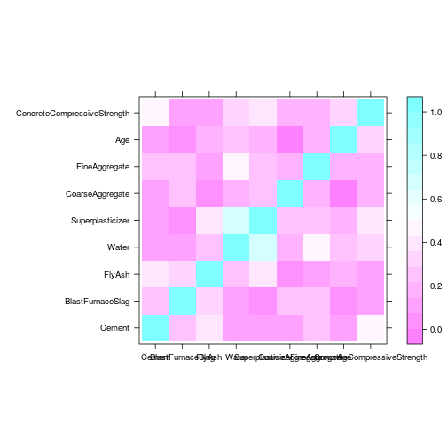
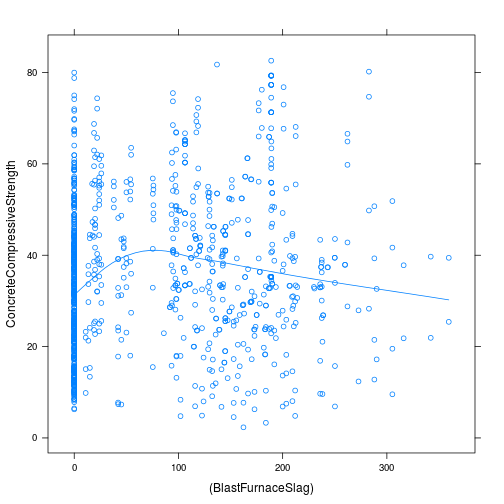
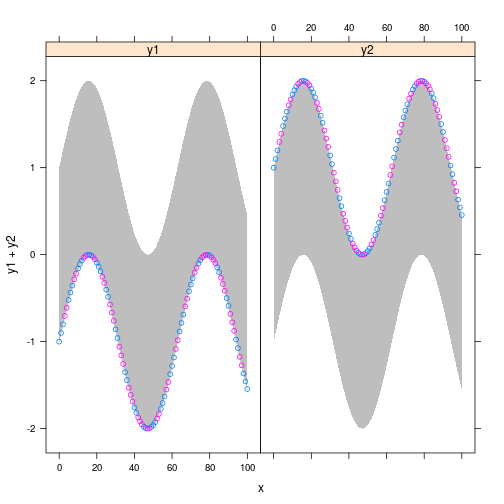
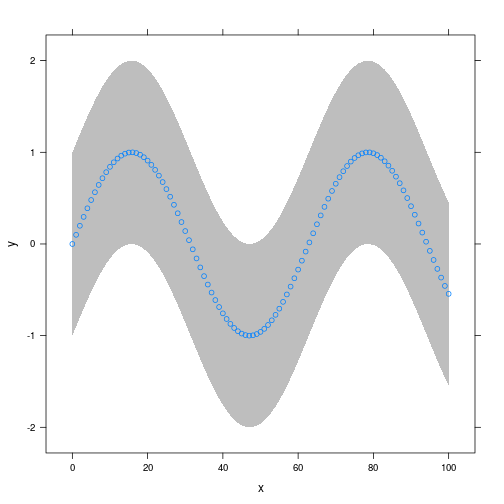
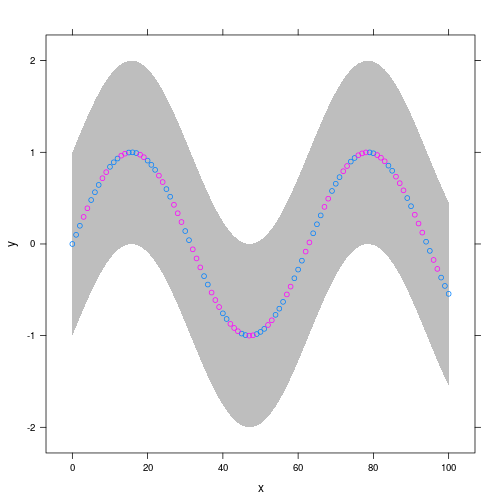
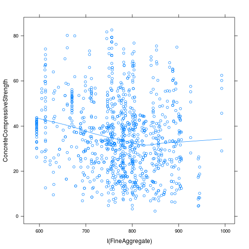

Д.з.3, задание 1.5 (bandplot)
========================================================
Задание 1.5. Написать (используя lattice) функцию bandplot, которая вызывается:

```
bandplot(lower + upper ~ x, data = ..., ...)
```
и рисует закрашенную “доверительную полоску”, задаваемую двумя границами. Долж-
но получаться что-то типа http://stackoverflow.com/questions/14069629/plotting-confide
Функция должна вести себя как xyplot, возвращать trellis-объект, понимать па-
раметр groups и | в формуле. Результат должен корректно взаимодействовать с опе-
рациями из latticeExtra.

Hint: Достаточно просто дополнить и немного переработать пример http://www.r-bloggers.com/confidence-bands-with-lattice-and-r/.


```r
library(lattice)
library(latticeExtra)
```

```
## Loading required package: RColorBrewer
```


```r
bandplot <- function(formula, data, groups=NULL, ...) {
  parsed <- latticeParseFormula(formula, data, multiple=TRUE, subscripts=T)
  lvl<-levels(parsed$groups)
  if (length(lvl) < 2) {
      eval(call("xyplot", as.formula(formula), groups=groups, data=data))
  } else {
  new_left <- if (length(lvl)>2) {  paste(lvl[-c(1, length(lvl))], sep="+")} else parsed$left.name#можно было бы здесь если 2 слагаемых возвращать пустую строку, тогда рисовался бы только контур на графике с lower+upper. но так появляются предупреждения, я не придумала, как от них избавиться
  right <- strsplit(toString(formula), ",")#а вот это нам пригодится, чтобы обрабатывать все, что справа от ~ в формуле
  new_formula <- paste(new_left, right[[1]][3], sep="~")
  lower.y <- parsed$left[parsed$groups == lvl[1]]
  lower.x <- parsed$right[parsed$groups == lvl[1]]
  upper.y <- parsed$left[parsed$groups == lvl[length(lvl)]]
  upper.x <- parsed$right[parsed$groups == lvl[length(lvl)]]

  prepanel2 <- function(x, y, ...) {
    p<-prepanel.default.xyplot(x,y,...)
    p$xlim <- c(min(lower.x, upper.x), max(upper.x, lower.x))
    p$ylim <- c(min(lower.y, upper.y), max(upper.y, lower.y))
    p
  }
  panel.bands <- function(x, y, upper, lower, fill, col, subscripts, ..., font, fontface) {
    panel.polygon(c(upper.x, rev(lower.x)), c(upper.y, rev(lower.y)), col = "grey", border = FALSE)
    if(!is.null(y))
      panel.xyplot(x, y, groups=groups, subscripts = subscripts, ...)
  }
  panel2 <- function(x, y, upper.x, upper.y, lower.x, lower.y, groups=NULL, ...) {
    if(!is.null(groups))
      panel.superpose(x, y, panel.groups = panel.bands, type='l', col='grey', groups=groups,...)
    panel.polygon(c(upper.x, rev(lower.x)), c(upper.y, rev(lower.y)), col = "grey", border = FALSE)
    panel.xyplot(x, y, groups=groups, ...)
  }
  eval(call("xyplot", as.formula(new_formula), groups=groups, data=data, prepanel=as.name("prepanel2"), panel = as.name("panel2"), upper.x=upper.x, upper.y=upper.y, lower.x=lower.x, lower.y =lower.y))
}
}
```
Добавим тестовые данные:

```r
data <- data.frame(0:100)
data$x <-0:100
data$y <-sin(data$x*0.1)
data$y1<-data$y-1
data$y2<-data$y+1
data$z<-sin(data$x*5) >0
```
Функция возвращает trellis-объект:

```r
class(bandplot(y ~ x, data))
```

```
## [1] "trellis"
```
В случае, когда в левой части формулы 1 слагаемое, функция ведет себя как обычный xyplot:

```r
#с группами
bandplot(y ~ x|z, data, groups=data$z)
```

 

Когда 2 слагаемых (lower+upper):

```r
bandplot(y1+y2 ~ x, data) #без группировки
```

 

```r
bandplot(y1+y2 ~ x, data, groups=data$z) #с группировкой
```

 

(из формулировки задания не совсем ясно, что в этом случае рисовать, кроме фона)

Когда 2+ слагаемых (lower+y+upper):

```r
bandplot(y1+y+y2 ~ x, data) #без группировки
```

 

```r
bandplot(y1+y+y2 ~ x, data, groups=data$z)#с группировкой
```

 

Проверим, что все работает, если в формуле есть |

```r
bandplot(y1+y+I(y+sin(2*x)+1) ~ x|z, data, groups=data$z)#с группировкой
```

 
