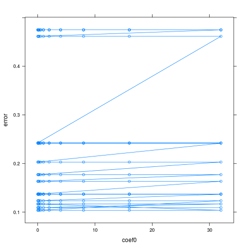

Задание 1.2 (glaucomaMVF)
========================================================

Задание 1.2 (SVM, простое). Используя SVM, построить классификатор для данных
GlaucomaMVF. Сравнить между собой разные ядра (линейное, полиномиальное, гауссов-
ское), объяснить результат.


```r
glaucomaMVF <- read.table("data/GlaucomaMVF.txt", header = TRUE)

svm.linear <- svm(Class ~ ., data = glaucomaMVF, type = "C-classification", kernel = "linear")
table(actual = glaucomaMVF$Class, predicted = predict(svm.linear))
```

```
##           predicted
## actual     glaucoma normal
##   glaucoma       75      0
##   normal          2     76
```

```r
tn.linear <- tune.svm(Class ~ ., data = glaucomaMVF, type= "C-classification", kernel = "linear", cost = 2^(-15:10))
tn.linear
```

```
## 
## Parameter tuning of 'svm':
## 
## - sampling method: 10-fold cross validation 
## 
## - best parameters:
##    cost
##  0.0625
## 
## - best performance: 0.09875
```

```r
xyplot(tn.linear$performances[, "error"] ~ log(tn.linear$performances[, "cost"]), type = "b", xlab="cost", ylab="error")
```

 

```r
table(actual = glaucomaMVF$Class, predicted = predict(tn.linear$best.model))
```

```
##           predicted
## actual     glaucoma normal
##   glaucoma       69      6
##   normal          4     74
```

Видим, что если использовать линейное ядро, данные относительно неплохо разделяются. Посмотрим, что произойдет, если использовать полиномиальное однородное ядро. 


```r
tn.polynomial <- tune.svm(Class ~ ., data = glaucomaMVF, type = "C-classification", kernel = "polynomial", cost = 2^(-5:10), degree=1:10)
opt.cost <- tn.polynomial$best.parameters$cost

tn.polynomial <- tune.svm(Class ~ ., data = glaucomaMVF, type = "C-classification", kernel = "polynomial", cost = opt.cost, degree=1:10)
tn.polynomial
```

```
## 
## Parameter tuning of 'svm':
## 
## - sampling method: 10-fold cross validation 
## 
## - best parameters:
##  degree cost
##       1   32
## 
## - best performance: 0.1175
```

```r
opt.degree<- tn.polynomial$best.parameters$degree

xyplot(tn.polynomial$performances[, "error"] ~ (tn.polynomial$performances[, "degree"]), 
       type = "b", xlab="degree", ylab="error")
```

 

```r
table(actual=glaucomaMVF$Class, predicted = predict(tn.polynomial$best.model))
```

```
##           predicted
## actual     glaucoma normal
##   glaucoma       75      0
##   normal          2     76
```

Получили, что наилучшие результаты при использовании полиномиального ядра достигаются при cost=32, при степени полинома 1. То есть получили все то же линейное ядро.

Попробуем добавить неоднородности:


```r
tn.polynomial2 <- tune.svm(Class ~ ., data = glaucomaMVF, type = "C-classification", kernel = "polynomial", cost = opt.cost, degree=opt.degree, coef0=-100:100)
tn.polynomial2
```

```
## 
## Parameter tuning of 'svm':
## 
## - sampling method: 10-fold cross validation 
## 
## - best parameters:
##  degree coef0 cost
##       1  -100   32
## 
## - best performance: 0.1054167
```

```r
xyplot(tn.polynomial2$performances[, "error"] ~ (tn.polynomial2$performances[, "coef0"]), 
       type = "b", xlab="coef0", ylab="error")
```

 

```r
table(actual=glaucomaMVF$Class, predicted = predict(tn.polynomial2$best.model))
```

```
##           predicted
## actual     glaucoma normal
##   glaucoma       75      0
##   normal          2     76
```

Видим, что на результат значение coef0 никак не влияет (ничего удивительного, степень полинома 1, а если плоскость сдвигать относительно самой себя, результат никак не изменится).

Попробуем то же самое проделать с радиальным ядром.


```r
tn.radial <- tune.svm(Class ~ ., data = glaucomaMVF, type = "C-classification", kernel = "radial", cost = 2^(-5:10), gamma=2^(-15:0)) 
tn.radial
```

```
## 
## Parameter tuning of 'svm':
## 
## - sampling method: 10-fold cross validation 
## 
## - best parameters:
##         gamma cost
##  0.0002441406  128
## 
## - best performance: 0.1245833
```

```r
plot(tn.radial, transform.x = log, transform.y = log, color.palette = rainbow)
```

 

```r
table(actual=glaucomaMVF$Class, predicted = predict(tn.radial$best.model))
```

```
##           predicted
## actual     glaucoma normal
##   glaucoma       69      6
##   normal          4     74
```

При использовании радиального ядра наилучшие результаты достигаются при gamma=2.4414062 &times; 10<sup>-4</sup>.
