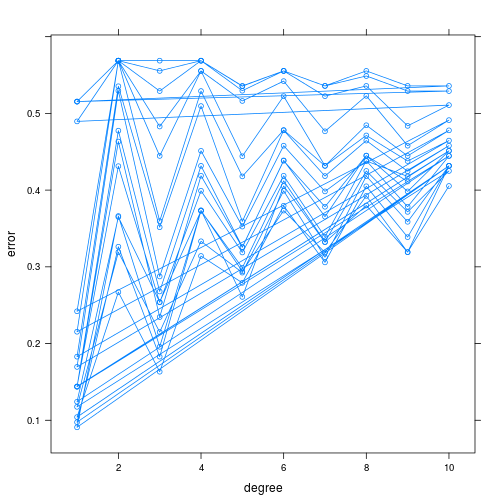

Задание 1.2 (glaucomaMVF)
========================================================

Задание 1.2 (SVM, простое). Используя SVM, построить классификатор для данных
GlaucomaMVF. Сравнить между собой разные ядра (линейное, полиномиальное, гауссов-
ское), объяснить результат.


```r
glaucomaMVF <- read.table("data/GlaucomaMVF.txt", header = TRUE)

svm.linear <- svm(Class ~ ., data = glaucomaMVF, type = "C-classification", kernel = "linear")
table(actual = glaucomaMVF$Class, predicted = predict(svm.linear))
```

```
##           predicted
## actual     glaucoma normal
##   glaucoma       75      0
##   normal          2     76
```

```r
tn.linear <- tune.svm(Class ~ ., data = glaucomaMVF, type= "C-classification", kernel = "linear", 
         cost = 2^(-15:10))
tn.linear
```

```
## 
## Parameter tuning of 'svm':
## 
## - sampling method: 10-fold cross validation 
## 
## - best parameters:
##  cost
##     1
## 
## - best performance: 0.1183333
```

```r
xyplot(tn.linear$performances[, "error"] ~ log(tn.linear$performances[, "cost"]), type = "b", xlab="cost", ylab="error")
```

 

```r
table(actual = glaucomaMVF$Class, predicted = predict(tn.linear$best.model))
```

```
##           predicted
## actual     glaucoma normal
##   glaucoma       75      0
##   normal          2     76
```

Видим, что если использовать линейное ядро, данные относительно неплохо разделяются. Посмотрим, что произойдет, если использовать полиномиальное однородное ядро. 


```r
tn.polynomial <- tune.svm(Class ~ ., data = glaucomaMVF, type = "C-classification", kernel = "polynomial", cost = 2^(-5:15))
tn.polynomial
```

```
## 
## Parameter tuning of 'svm':
## 
## - sampling method: 10-fold cross validation 
## 
## - best parameters:
##  cost
##    16
## 
## - best performance: 0.1625
```

```r
xyplot(tn.polynomial$performances[, "error"] ~ log(tn.polynomial$performances[, "cost"]), 
       type = "b", xlab="cost", ylab="error")
```

 

```r
table(actual=glaucomaMVF$Class, predicted = predict(tn.polynomial$best.model))
```

```
##           predicted
## actual     glaucoma normal
##   glaucoma       74      1
##   normal          0     78
```

Получили, что наилучшие результаты при использовании полиномиального ядра достигаются при cost=16


```r
tn.radial <- tune.svm(Class ~ ., data = glaucomaMVF, type = "C-classification", kernel = "radial", cost = 2^(-5:10), gamma=2^(-15:0)) 
tn.radial
```

```
## 
## Parameter tuning of 'svm':
## 
## - sampling method: 10-fold cross validation 
## 
## - best parameters:
##         gamma cost
##  0.0001220703 1024
## 
## - best performance: 0.11875
```

```r
plot(tn.radial, transform.x = log, transform.y = log, color.palette = rainbow)
```

 

```r
table(actual=glaucomaMVF$Class, predicted = predict(tn.radial$best.model))
```

```
##           predicted
## actual     glaucoma normal
##   glaucoma       74      1
##   normal          3     75
```

При использовании радиального ядра наилучшие результаты достигаются при gamma=1.2207031 &times; 10<sup>-4</sup>.
