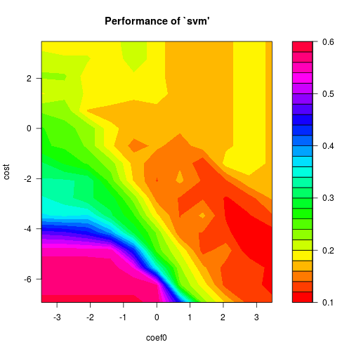

Задание 1.2 (glaucomaMVF)
========================================================

Задание 1.2 (SVM, простое). Используя SVM, построить классификатор для данных
GlaucomaMVF. Сравнить между собой разные ядра (линейное, полиномиальное, гауссов-
ское), объяснить результат.


```r
glaucomaMVF <- read.table("data/GlaucomaMVF.txt", header = TRUE)

svm.linear <- svm(Class ~ ., data = glaucomaMVF, type = "C-classification", kernel = "linear")
table(actual = glaucomaMVF$Class, predicted = predict(svm.linear))
```

```
##           predicted
## actual     glaucoma normal
##   glaucoma       75      0
##   normal          2     76
```

```r
tn.linear <- tune.svm(Class ~ ., data = glaucomaMVF, type= "C-classification", kernel = "linear", cost = 2^(-15:10))
tn.linear
```

```
## 
## Parameter tuning of 'svm':
## 
## - sampling method: 10-fold cross validation 
## 
## - best parameters:
##   cost
##  0.125
## 
## - best performance: 0.11125
```

```r
xyplot(tn.linear$performances[, "error"] ~ log(tn.linear$performances[, "cost"]), type = "b", xlab="cost", ylab="error")
```

 

```r
table(actual = glaucomaMVF$Class, predicted = predict(tn.linear$best.model))
```

```
##           predicted
## actual     glaucoma normal
##   glaucoma       70      5
##   normal          4     74
```

Видим, что если использовать линейное ядро, данные относительно неплохо разделяются. Посмотрим, что произойдет, если использовать полиномиальное однородное ядро. 


```r
tn.polynomial <- tune.svm(Class ~ ., data = glaucomaMVF, type = "C-classification", kernel = "polynomial", degree=2, cost=2^(-10:5), coef0=2^(-5:5))

tn.polynomial
```

```
## 
## Parameter tuning of 'svm':
## 
## - sampling method: 10-fold cross validation 
## 
## - best parameters:
##  degree coef0 cost
##       2    32    1
## 
## - best performance: 0.09166667
```

```r
tn.polynomial <- tune.svm(Class ~ ., data = glaucomaMVF, type = "C-classification", kernel = "polynomial", cost=2^(-10:5), degree=1:10)
tn.polynomial
```

```
## 
## Parameter tuning of 'svm':
## 
## - sampling method: 10-fold cross validation 
## 
## - best parameters:
##  degree cost
##       1   16
## 
## - best performance: 0.105
```

```r
opt.degree<- tn.polynomial$best.parameters$degree

#xyplot(tn.polynomial$performances[, "error"] ~ (tn.polynomial$performances[, "degree"]),       type = "b", xlab="degree", ylab="error")

table(actual=glaucomaMVF$Class, predicted = predict(tn.polynomial$best.model))
```

```
##           predicted
## actual     glaucoma normal
##   glaucoma       74      1
##   normal          3     75
```

Получили, что наилучшие результаты при использовании полиномиального ядра достигаются при cost=16, при степени полинома 1. То есть получили все то же линейное ядро.

Попробуем добавить неоднородности:


```r
tn.polynomial2 <- tune.svm(Class ~ ., data = glaucomaMVF, type = "C-classification", kernel = "polynomial", cost=2^(-10:5), degree=opt.degree, coef0=2^(-5:5))
tn.polynomial2
```

```
## 
## Parameter tuning of 'svm':
## 
## - sampling method: 10-fold cross validation 
## 
## - best parameters:
##  degree   coef0 cost
##       1 0.03125   32
## 
## - best performance: 0.1179167
```

```r
#xyplot(tn.polynomial2$performances[, "error"] ~ (tn.polynomial2$performances[, "coef0"]), type = "b", xlab="coef0", ylab="error")

table(actual=glaucomaMVF$Class, predicted = predict(tn.polynomial2$best.model))
```

```
##           predicted
## actual     glaucoma normal
##   glaucoma       75      0
##   normal          2     76
```

Видим, что на результат значение coef0 никак не влияет (ничего удивительного, степень полинома 1, а если плоскость сдвигать относительно самой себя, результат никак не изменится).


```r
tn.polynomial3 <- tune.svm(Class ~ ., data = glaucomaMVF, type = "C-classification", kernel = "polynomial", cost=2^(-10:5), coef0=2^(-5:5))
tn.polynomial3
```

```
## 
## Parameter tuning of 'svm':
## 
## - sampling method: 10-fold cross validation 
## 
## - best parameters:
##  coef0      cost
##     32 0.0078125
## 
## - best performance: 0.1045833
```

```r
plot(tn.polynomial3, transform.x = log, transform.y = log, color.palette = rainbow)
```

 

```r
table(actual=glaucomaMVF$Class, predicted = predict(tn.polynomial3$best.model))
```

```
##           predicted
## actual     glaucoma normal
##   glaucoma       75      0
##   normal          2     76
```

Попробуем то же самое проделать с радиальным ядром.


При использовании радиального ядра наилучшие результаты достигаются при gamma=r tn.radial$best.parameters$gamma.
